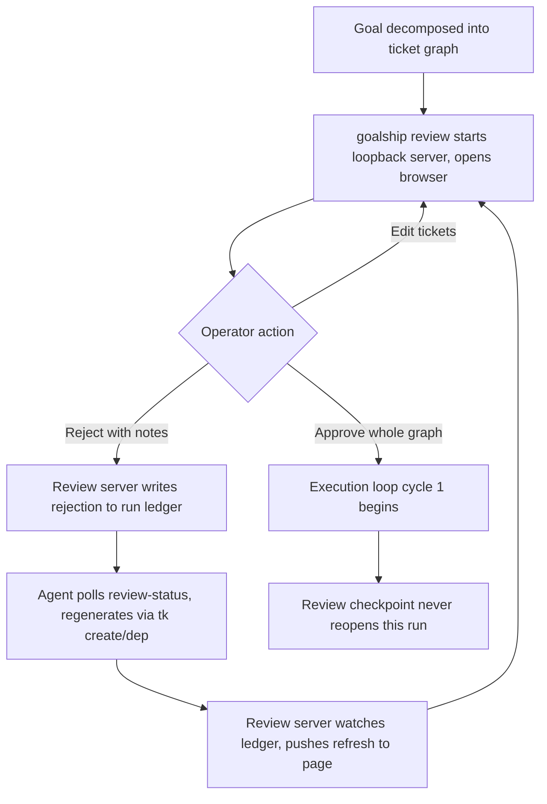
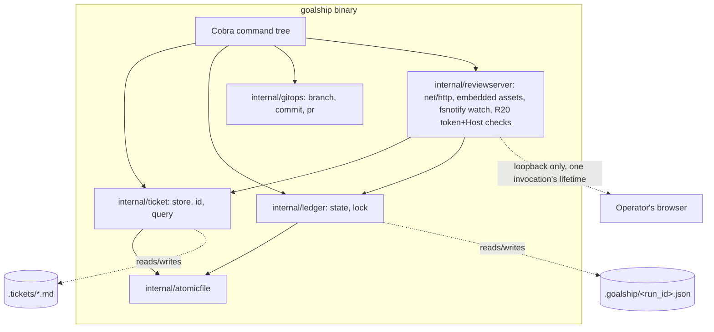

# Goalship CLI - Plan

## Goal Capsule

- **Objective:** A user running goalship's goal-to-PR loop can see, edit, and approve — or reject with notes for revision — the decomposed ticket graph before any ticket starts executing, and every mechanic underneath that loop (ticket tracking, git/gh operations) runs through one installed tool instead of bash `tk` plus a Python script.
- **Means:** Replace bash `tk` (wedow/ticket) and goalship's Python `loop_runner.py` with a single Go CLI, `goalship`, and insert a browser-based review checkpoint — a loopback-only local web server embedded in the same binary, coordinating with the orchestrating agent purely through the run ledger, no MCP or other persistent listening process — into the execution loop between decomposition and the per-cycle loop.
- **Product authority:** In the sibling `agent-extentions` repo, `docs/plans/2026-08-24-1234-feat-goal-to-ticket-loop-plan.md` is settled product authority for goalship's own loop semantics (caps, terminal states, reconciliation). This plan is additive to it — a new tool and a new pre-loop checkpoint — not a revision of its requirements or decisions.
- **Open blockers:** None. Ready for planning.

---

## Product Contract

### Summary

A standalone Go CLI, `goalship`, replaces bash `tk` and the Python `loop_runner.py` mechanics behind goalship's execution loop, installed on PATH like `tk`/`gh`/`glab` today. It adds a pre-loop review checkpoint — `goalship review <run-id>` starts a loopback-only local web server (assets embedded in the binary via Go's `embed.FS`, no Node/JS build step), opens it in the operator's default browser, and blocks in the foreground for the review's duration — where the user edits and approves the decomposed ticket graph, or rejects it with notes for the agent to regenerate, before any ticket starts executing; the review server and the agent coordinate entirely through the run ledger, with no MCP server or other persistent listening process involved.

### Problem Frame

goalship's execution loop today calls bash `tk` (github.com/wedow/ticket) for ticket storage and a Python script (`loop_runner.py`) for git/gh mechanics. Nothing sits between ticket decomposition and the per-cycle loop where a human can look at what was decomposed: `execution-loop.md`'s "Once per run: preflight" section reports the resolved trunk branch and then the per-cycle loop starts — it never pauses on the ticket graph itself, and once a cycle begins the loop is deliberately never blocked on user input again.

Separately, `tk`'s ticket IDs are a repo-prefix plus four random characters with no relationship to creation order, so a directory listing of `.tickets/` doesn't reflect when tickets were made — there's no way to tell, at a glance, which ticket came first.

### Requirements

**Ticket tool**
- R1. `goalship tk` supports every command bash `tk` (wedow/ticket 0.3.2) supports today: `create`, `start`, `close`, `reopen`, `status`, `dep`, `undep`, `dep tree`, `dep cycle`, `link`, `unlink`, `ls`/`list`, `ready`, `blocked`, `closed`, `show`, `edit`, `add-note`, `query`, `migrate-beads`.
- R2. `goalship tk` reads and writes the same `.tickets/*.md` frontmatter fields (`id`, `status`, `deps`, `links`, `created`, `type`, `priority`, plus optional fields) and the same `## Notes` section format bash `tk` uses today, so an existing `.tickets/` directory keeps working unmodified.
- R3. Every `goalship tk` command resolves ticket IDs the way bash `tk` does: an exact filename match, or a single unambiguous substring match anywhere in `.tickets/*.md` filenames.

**Ticket ID scheme**
- R4. New tickets created by `goalship tk create` get an ID shaped `<repo-prefix>-<YYYYMMDD-HHMM>-<4-char-random-suffix>` (e.g. `ae-20260827-1755-05hv`), so a directory listing of `.tickets/` sorts in creation order. The 4-char suffix is random, not sequential, so two tickets created in the same minute sort only by that random tail relative to each other, not by actual creation order; this is an accepted consequence of the Key Decisions' explicit choice of a random suffix over a monotonic counter (which would need new counter-file coordination), not a gap this plan intends to close — R4's sort guarantee is minute-granularity by construction.
- R5. Existing tickets keep their current ID shape (`<repo-prefix>-<4-char-random-suffix>`) permanently; `goalship` never renames or migrates them, so mixed-format `.tickets/` directories are the expected steady state.

**Loop mechanics**
- R6. `goalship <subcommand>` provides the same CLI surface `loop_runner.py` provides today (`preflight`, `reconcile`, `ledger`, `resume-candidates`, `dirty`, `branch-name`, `resolve-base`, `commit-landed`, `run-branch`, `find-pr`, `claim`, `commit`, `head-sha`, `push`, `create-pr`, `retarget-pr`, `ship`, `reset`), with the same argv shape and JSON output shape, so goalship's skill shells out to `goalship` exactly where it shells out to `loop_runner.py` today.
- R7. goalship's existing per-run ledger (`.goalship/<run_id>.json`) gains `review_state` (`pending`/`rejected`/`approved`), `review_notes`, `review_updated_at`, and `approved_ticket_ids` fields, written atomically (temp-file + rename, matching the ledger's existing write path) alongside the existing `trunk_branch` field — so the review checkpoint has somewhere durable to record its state without a new file format. A ledger with no `review_state` at all (an older ledger file predating this field, or one read via `.get()`-style defaulting) is treated identically to `pending` — never as implicitly approved — so R16's claim gate has no way to be silently bypassed by an unset field.
- R8. goalship's ledger codec preserves any JSON key it does not recognize, round-tripping it unchanged on every load/save cycle, rather than silently dropping it — closed-field-set ledger structs are the mechanism that would otherwise strip R7's new fields on a touch from code that predates them. Governs the same guarantee for `.tickets/*.md` frontmatter: an unrecognized field survives a `goalship tk` read/write round-trip.

**Review checkpoint**
- R9. After a goal is decomposed into a ticket graph and before goalship's execution loop starts its first cycle, `goalship review <run-id>` starts a local review web server bound to loopback only, opens it in the operator's default browser, and lists every ticket in the graph. If `<run-id>` doesn't exist, or its ledger `review_state` is already `approved`, the server refuses to start and the CLI reports a clear error instead — consistent with how preflight failures are reported elsewhere in this system.
- R10. In the review page, the user can edit any ticket's fields (title, description, acceptance criteria, priority, dependencies) through structured HTML form fields — a separate editing path from `goalship tk edit`, which stays a bare `$EDITOR` shell-out on the raw file to preserve R1's parity with bash `tk`'s own `cmd_edit`; the two are not unified. Each edit submitted from the page writes straight through to `.tickets/*.md` immediately via the review server's local JSON API (no in-memory draft, no separate flush-on-approve step) — except while a rejection is awaiting the agent's regeneration, during which the page goes read-only and the server rejects mutating requests outright. This is a convention enforced only by the review server's own read-only mode, not a filesystem lock on `.tickets/*.md`: a `tk create`/`dep` call issued outside the review page (a stray script, a second agent session) is not blocked by anything at the file level. Deleting or renaming a ticket is out of scope for the review page, matching bash `tk`'s own command surface, which has no delete operation. The dependency field is edited through a searchable multi-select over the current ticket list (showing each option as ID plus title, not a bare ID), backed by the same add/remove semantics as `tk dep`/`undep` rather than a raw-text full-array replace, and rejects (client- and server-side) any ID that doesn't resolve via U2's ID resolver (R3) — a raw ID text box is not sufficient given how opaque ticket IDs are on their own. The page tracks per-ticket-form dirty state client-side: a live-refresh event (R11) never overwrites an open, unsaved edit — it queues the update instead — and a `PATCH` that arrives just as the graph flips read-only fails with the operator's typed content still visible on the form, not discarded. The read-only view shown while a rejection awaits regeneration displays an explicit banner stating the rejection was recorded and regeneration is pending, and that banner updates the moment R11's refresh lands, so the transition back to editable is visibly explained rather than the page silently re-enabling.
- R11. The user can reject the graph as a whole with notes explaining what's wrong; on reject, `goalship review` writes `review_state: rejected` and the notes to the run ledger via an atomic write, then watches that same ledger file and pushes a refresh to the open browser page as soon as the agent's regeneration lands — without the page reloading or the review process restarting.
- R12. The user can approve the graph as a whole; approval is all-or-nothing across the current ticket set, not per-ticket, and is recorded as `review_state: approved` on the run ledger, together with `approved_ticket_ids` — the exact set of ticket IDs in the graph at the moment of approval. No `goalship` command other than the review page's approve action ever writes `review_state: approved`; in particular, `goalship loop ledger`'s flag-per-field update surface (R6) never grows a flag that sets `review_state` or `approved_ticket_ids` directly.
- R13. The orchestrating agent discovers a pending rejection by calling `goalship review-status <run-id>` — a plain CLI command, the same pattern already used for every other `goalship`/`tk` interaction — at its own turn boundary, then regenerates the graph using `goalship tk create`/`dep`, and writes `review_state: pending` back to the ledger as the last step of that sequence, after every `tk create`/`dep` call for the regeneration has landed and clearing `review_notes` (they've been addressed) — so the review page's ledger-driven refresh never surfaces a partially-regenerated graph. The orchestrating skill's own resume-check tests for `review_state: rejected` at every re-entry, not only immediately after decomposition, so a rejection whose regeneration never happened (e.g. the agent's session ended first) is surfaced and re-driven rather than sitting unnoticed indefinitely. This last-step-write ordering is a convention the agent's own prose follows, the same way R10's read-only mode is; nothing in `goalship` enforces it structurally (see Risks & Dependencies for the resulting orphaned-partial-regeneration risk). `goalship review-status` also reports `review_state: approved` (not only `pending`/`rejected`), so a caller never has to special-case approval against a bare absence of rejection.
- R14. `goalship review` refuses a second concurrent invocation against the same run-id — a lock scoped to that run, released on clean exit — so two review-server processes can never edit the same run's tickets at once. Subject to that, the review checkpoint can be entered in the same session immediately after decomposition, or re-entered later in a different session against the same run, as long as that run's ledger `review_state` is not yet `approved` — using goalship's existing run-ledger to identify which run is being resumed.
- R15. Once the user approves and the execution loop's first cycle begins, the review checkpoint does not reopen for the remainder of that run — this preserves the loop's existing "never blocked mid-cycle" guarantee.
- R16. Independent of whether the orchestrating agent checks `review-status` on its own, `goalship`'s ticket-claiming path (the `claim` subcommand under R6) itself refuses to claim any ticket for a run whose ledger `review_state` is not `approved`, and further refuses unless the claimed ticket ID is present in that run's `approved_ticket_ids` (R7, R12) — mirroring how this codebase's other safety invariants (merge/force-push/branch-delete prevention) are enforced structurally in the scripts and asserted by tests against their own source, not left to agent-followed prose. The `approved_ticket_ids` check closes two gaps a bare `review_state` flag leaves open: a `tk create`/`dep`/`edit` call landing after approval can no longer silently mutate the graph `claim` trusts, and claiming a ticket that belongs to a different, unapproved run under this run's (approved) run-id fails loudly instead of silently succeeding. It does not make `claim` fully run-sound: `.tickets/` remains a single repo-global store with no `run_id` field on the ticket itself (Scope Boundaries), so a ticket ID that happens to appear in two different runs' `approved_ticket_ids` sets is not distinguished by this check.
- R19. The operator can withdraw a pending rejection directly from the review page, moving `review_state` from `rejected` back to `pending` without waiting on or involving the orchestrating agent — the same `rejected → pending` ledger transition R13 uses, reachable from a second trigger so an operator isn't stuck if the agent's session is permanently gone.
- R20. The review server binds only to loopback (`127.0.0.1`/`::1`), never a routable interface, and every request — including the initial page load — must present a per-invocation random token minted fresh when `goalship review` starts (the same threat model Jupyter Notebook's long-standing `--NotebookApp.token` addresses: the token is embedded in the URL the CLI opens, never persisted, never reused across invocations). The token is generated via a cryptographically secure random source (Go's `crypto/rand`, never `math/rand`), at least 32 bytes of randomness, encoded for the URL. It is carried as a URL query parameter uniformly on every request — the initial page load, every mutating and read API call, and the live-refresh connection (R11) alike — rather than a cookie, specifically because a browser's native `EventSource` (the live-refresh transport) cannot set custom headers, and a cookie-carried token would attach itself automatically to any request regardless of origin, reintroducing the ambient-credential CSRF pattern this requirement exists to close. Every mutating request additionally validates the `Host` header, with any port suffix stripped first (the server's ephemeral bind means the header always includes one), against `localhost`/`127.0.0.1`/`::1`. A request failing either check is refused with no partial effect — before any ticket or ledger read/write happens — so a page open in an unrelated browser tab cannot forge an approve/reject/edit via DNS rebinding or ambient-cookie CSRF, which are both documented attack classes against un-tokenized localhost servers specifically (not just remote-network attackers). Separately, every ticket field rendered in the page — including R10's markdown preview — is escaped and treated as data, never as live HTML: markdown rendering passes through an allowlisted sanitizer, and every response carries a restrictive Content-Security-Policy (`object-src 'none'`, `base-uri 'none'`, `frame-ancestors 'none'`), so a malicious ticket title, description, or note cannot execute script in the review page's own origin and use the operator's live token to approve, reject, or edit on their behalf. Every response also carries `Referrer-Policy: no-referrer`, so a token-bearing URL is never leaked via the `Referer` header when the markdown preview (R10) renders a link or image pointing at an external resource.

**Distribution & compatibility**
- R17. `goalship` ships as a single compiled binary the user installs on PATH (mirroring how `tk`/`gh`/`glab` are installed today), from its own repository — not bundled inside the `agent-extentions` goalship plugin. The review page's HTML/CSS/JS assets are embedded into this same binary via Go's `embed.FS`; no Node/JS build toolchain is introduced, and no separate asset bundle ships alongside the binary.
- R18. `goalship` runs no MCP server and no other persistent listening process outside the review server's own bounded lifetime; every coordination point between the review server and the orchestrating agent happens through reads and atomic writes to the run ledger under `.goalship/`, so either process can start, stop, or restart independently with no live connection to the other. This depends on both processes resolving `.goalship/` from the same `repo_root` — true by construction, since both are invoked against the same checked-out repo — never a separately-configured path per process. The review server itself is not an exception to "no persistent listening process": it binds a port only for the duration of one `goalship review` invocation (R14's lock is held for that same span) and is gone the moment the process exits — never a background daemon a later invocation reconnects to.

### Key Decisions

- **Full 1:1 port of `tk`'s entire command surface, not just what goalship's loop needs today.** (session-settled: user-directed — chosen over porting only the ~7 commands goalship's loop calls: wants `goalship tk` to be a complete standalone replacement for bash `tk` immediately, with no lingering bash dependency.) Governs R1.
- **`goalship tk query` and `migrate-beads` embed `github.com/itchyny/gojq` (the standard full-compatibility pure-Go jq implementation) rather than shelling out to system `jq` or reducing the filter surface to typed flags.** Confirmed directly against the installed `tk` binary, not just inferred: `cmd_query` passes a caller-supplied filter straight into `jq -c "select($filter)"` with no restriction, and `cmd_migrate_beads` runs a genuinely non-trivial jq program (`def` functions, `map`, string interpolation, the `//` alternative operator) — a hand-rolled minimal filter parser or a typed-flag surface could not reproduce either, and shelling to system `jq` would leave a real external dependency the single-binary distribution decision (R17) rules out. Governs R1.
- **New ticket IDs get a readable date-time prefix plus the existing random suffix; existing tickets are never migrated.** (session-settled: user-directed — chosen over UUIDv7, too long for `tk`'s short-fragment-typing convenience, and over a bare sequence counter, which needs new counter-file coordination; modeled directly on this repo's own `docs/plans/*.md` filename convention.) Governs R4, R5.
- **The review checkpoint is a local, loopback-only browser page served by the `goalship` binary itself, not a terminal wizard.** (session-settled: user-directed, superseding this plan's original TUI decision — richer form editing (real textareas, markdown preview, mouse-first interaction) was judged worth more than the TUI's SSH/headless-portability advantage. The browser-page-from-CLI pattern has real precedent — `gh pr create --web`, Jupyter Notebook's local server + one-time token, `temporal server start-dev`'s bundled UI — and assets are embedded into the binary via Go's `embed.FS` (R17), so no Node/JS build toolchain is introduced and single-binary distribution is unaffected. The server binds loopback-only and requires a per-invocation token (R20) specifically because, unlike a TUI, a local web server is reachable by any other tab or extension open in the operator's browser at the same time: DNS rebinding lets an attacker-controlled hostname resolve to `127.0.0.1` after passing the browser's same-origin check, and CSRF via ambient state lets any page silently submit to an un-tokenized localhost endpoint — both are documented, real attack classes against localhost dev servers specifically, not just remote-network attackers, which is why R20 exists as a first-class requirement rather than an implementation afterthought.) Governs R9, R20.
- **`goalship` distributes as a standalone binary on PATH, in its own repository — not bundled inside the goalship plugin.** (session-settled: user-directed — chosen over shipping prebuilt per-platform binaries inside the plugin: mirrors how `tk`/`gh`/`glab` are already expected on PATH today.) Governs R17.
- **Rejecting the ticket graph coordinates through the run ledger via plain CLI calls (`goalship review-status`), not an MCP server `goalship` runs.** (session-settled: user-directed, superseding an earlier session-settled choice — the brainstorm originally settled on an MCP server for live regeneration; re-confirmed directly with the user once planning-stage research showed neither leg of that goal needs MCP, per the "report evidence a settled decision cannot work" rule. Mechanism in KTD2. Re-confirmed a second time in this session against a proposed web-page-plus-MCP-server alternative: MCP's own human-in-the-loop primitive, elicitation, renders inside the MCP *client's* own interface — i.e. inside Claude Code's chat — not a separate browser tab, so it doesn't deliver the browser-page goal at all; pairing it with a separate local web server would need two integration surfaces instead of one, and would reopen exactly the abandoned-listener lifecycle risk this decision already ruled out.) Governs R7, R10, R11, R13, R18.
- **`goalship <subcommand>` is a faithful 1:1 port of `loop_runner.py`'s existing CLI surface — same subcommands, same argv shape, same JSON output — not an occasion to add new capability.** Inferred from the original request's own phrasing, not separately probed in dialogue. Flag if broader scope was intended. Governs R6.
- **Repo and CLI binary are both named `goalship`.** Agent-selected under explicit delegation: the user deferred naming through the dialogue, then asked the agent to decide. Verified no PATH or Homebrew-formula collision, unlike `gs`, which collides with the installed Ghostscript binary. The name matches the plugin's existing brand and the outcome the system delivers.
- **Approval is enforced structurally in `goalship`'s `claim` path, not only by the orchestrating agent choosing to check `review-status` first.** Agent-inferred from a real gap a planning-stage flow analysis surfaced, not discussed in dialogue — flag if this over-reaches. Every other safety invariant this codebase has (merge, force-push, branch-delete prevention) is enforced in the scripts' own source and asserted there by `tests/test_branching.py`, not left to an agent following prose correctly; a review checkpoint whose only enforcement is "the agent is supposed to check first" is a materially weaker guarantee than the rest of this system and would let a degraded or buggy agent turn claim an unreviewed or explicitly-rejected graph. Chosen over leaving enforcement entirely to R13's agent-side `review-status` check, which stays as the discovery mechanism for the *regenerate* path but is no longer the graph's only line of defense. A deepening-stage architecture/data-integrity pass found the bare flag alone left two doors open (post-approval mutation, cross-run ticket confusion); `approved_ticket_ids` closes both without a full ticket-schema redesign — see R16 for the honest limit of what it does and does not guarantee. Governs R16.
- **`goalship review` takes a per-run-id lock, and refuses to open for a missing or already-approved run-id, rather than leaving concurrent-review and invalid-invocation behavior undefined.** Agent-inferred from the same flow analysis: without a lock, two review-server processes could edit one run's tickets concurrently with no conflict detection; without an explicit missing/approved-run-id behavior, two implementers would plausibly build two different UIs (hard error vs. read-only summary). The hard-error default matches this codebase's existing preflight-failure reporting style. The lock mechanism itself is OS-native advisory locking (KTD4), not a PID-liveness check — a deepening-stage data-integrity pass found PID-liveness races on both PID reuse and a non-atomic check-then-write acquire. Governs R9, R14.

### Actors

- A1. **Operator** — the human running goalship; reviews, edits, approves, or rejects-with-notes the ticket graph in the browser-based review page.
- A2. **Orchestrating agent** — the Claude Code session that decomposed the goal into tickets; at its own turn boundary, discovers a pending rejection via `goalship review-status` and regenerates the graph via `goalship tk create`/`dep`, writing the result back to the run ledger.
- A3. **Execution loop** — goalship's per-cycle loop; its `claim` path structurally refuses to start on any ticket whose run isn't `review_state: approved`, and it never reopens the review checkpoint once running.

### Key Flows

- F1. **Ticket-graph review**
  - **Trigger:** A goal has been decomposed into a ticket graph, before Phase 2's per-cycle loop starts (or the operator resumes a paused run later).
  - **Actors:** A1, A2, A3
  - **Steps:** Operator runs `goalship review <run-id>` → the CLI starts a loopback-only review server, opens it in the operator's browser (URL carries R20's one-time token) → the page lists every ticket → operator edits any tickets (or waits, read-only, while a rejection is pending regeneration) and either approves the whole graph or rejects it with notes → on reject, the review server writes the rejection to the run ledger; A2 discovers it via `goalship review-status` at its next turn boundary, regenerates the graph via `tk create`/`dep`, and writes the result back to the ledger → the review server, watching that same ledger file, pushes a refresh to the open page → operator repeats until approving.
  - **Outcome:** On approval, A3's first cycle begins against the approved graph; the checkpoint does not reopen for the remainder of the run, and A3's `claim` path would refuse to start regardless if `review_state` were ever anything but `approved`.
  - **Covers:** R9, R10, R11, R12, R15, R16, R19.



### Acceptance Examples

- AE1. **Covers R11, R12.** Given a decomposed ticket graph is shown in the review page, when the user edits two tickets and rejects the graph with a note explaining a missing dependency, then the review server writes the rejection to the run ledger, the orchestrating agent discovers it via `goalship review-status` and regenerates the graph incorporating that note, and the review server — watching the same ledger file — pushes a refresh to the open page: the user never leaves the browser tab or restarts `goalship review`.
- AE2. **Covers R12, R15.** Given the user approves the ticket graph in the review page, when the execution loop's first cycle begins, then `goalship review` cannot be re-entered for that run for the remainder of the run, regardless of how the run eventually terminates.
- AE3. **Covers R4, R5.** Given a repo's `.tickets/` directory already has tickets in the old `<prefix>-<4-char>` shape, when `goalship tk create` makes a new ticket, then the new ticket gets the `<prefix>-<YYYYMMDD-HHMM>-<4-char>` shape and the old tickets' filenames are untouched — `ls .tickets/` shows both shapes side by side.
- AE4. **Covers R9.** Given a run-id the operator mistypes, or one whose graph was already approved, when the operator runs `goalship review <run-id>`, then the review server refuses to start and the CLI reports a clear error rather than opening a browser tab showing an empty or misleadingly-editable view.
- AE5. **Covers R16.** Given a ticket graph whose `review_state` is still `pending` or `rejected` (never `approved`), when any process — including a degraded or misbehaving orchestrating agent that skips its own `review-status` check — calls `goalship`'s `claim` subcommand against one of that run's tickets, then `claim` refuses and reports why, independent of whatever the agent did or didn't check first.
- AE6. **Covers R19.** Given a run's `review_state` is `rejected` with notes recorded, when the operator invokes the review page's withdraw action before the orchestrating agent has regenerated the graph, then `review_state` moves directly to `pending` with no agent call involved, and the page becomes editable and rejectable again.
- AE7. **Covers R20.** Given `goalship review <run-id>` has started and opened the browser at its one-time-token URL, when a request arrives at the review server's port with a missing/incorrect token, or with a `Host` header other than `localhost`/`127.0.0.1`/`::1` on a mutating route, then the server refuses the request with no ticket or ledger read/write occurring, regardless of what else the request's body contains.

### Scope Boundaries

- Migrating existing ticket IDs into the new shape — permanently deferred; mixed-format `.tickets/` directories are the accepted steady state (R5).
- Reviewing tickets as a different person than whoever ran goalship — out of scope; the review checkpoint assumes one operator across "review now" and "review later" (R14).
- Bundling `goalship` inside the `agent-extentions` goalship plugin — it ships as a separate installable tool instead (R17).
- An MCP server or any other persistent listening process in `goalship` — considered twice (originally during the brainstorm, and again during this planning session against a proposed web-page-plus-MCP alternative) and explicitly dropped both times; all agent↔`goalship` coordination is plain CLI calls plus the run ledger (R18). The review server's own loopback HTTP listener is not an exception — it lives only for the span of one `goalship review` invocation (R9, R18, R20), not as a background daemon.
- Deleting or renaming tickets through the review page — out of scope; matches bash `tk`'s own command surface, which has no delete operation at all (R10).
- Multi-reviewer / remote access to the review page — out of scope; R20's loopback-only bind means the page is reachable only from the operator's own machine, matching R14's existing single-operator assumption. Exposing the review server beyond loopback (e.g. for a remote operator) is a materially different security posture this plan does not design for.
- Run-scoping the ticket store itself (e.g. a `run_id` field on `.tickets/*.md` so concurrent goalship runs against the same repo can't see each other's in-flight tickets) — a pre-existing condition of the ticket schema this plan inherits, not something this plan introduces or revises; `.tickets/` has always been a single, repo-global store shared across whatever runs are simultaneously resumable (`find_resumable_runs` already supports more than one). Fixing it would mean changing the ticket schema itself, which is out of this plan's charter per its product-authority assumption below. Flagged here as a known limitation: `goalship review` cannot currently filter to only its own run's tickets when two runs are in flight against one repo. R16's `approved_ticket_ids` check (added during deepening) mitigates the sharpest consequence of this limitation — a claim against a ticket that belongs to a different, unapproved run now fails loudly instead of silently succeeding — but it is a mitigation, not a fix: it does not distinguish a ticket ID that legitimately appears in two different runs' approved sets, and it does nothing for a `goalship review` invocation itself showing another run's in-flight tickets.

### Risks & Dependencies

**Dependencies:**
- This plan's review-checkpoint requirements (R9-R16, R19) require editing, in the separate `agent-extentions` repository, `plugins/goalship/skills/goalship/references/execution-loop.md` and `plugins/goalship/skills/goalship/SKILL.md`: inserting a new blocking-eligible review step between "Once per run: preflight" and "Every cycle" (mirroring the trunk-branch-determination precedent already there), converting every remaining bare `tk ...` and `python .../loop_runner.py ...` call site (at least 9, confirmed by direct read of `execution-loop.md`/`SKILL.md`/`decomposition.md` — not the smaller count an earlier draft of this plan assumed) to `goalship tk ...`/`goalship ...`, and updating the `which tk` precondition check to `which goalship`. **This cutover is a blocking completion criterion for this plan (see Definition of Done), not follow-up work**, and it must land as one atomic change across every call site — not staggered — for the reason in the next bullet.
- **Why the cutover must be atomic, not staggered:** confirmed directly against `agent-extentions/plugins/goalship/scripts/run_state.py`: `RunState.to_dict()`/`from_dict()` read and write a closed, hardcoded field set, and `loop_runner.py`'s `cmd_ledger` (its `goalship loop ledger` equivalent) calls `save_run_state` unconditionally, even on a bare status read. If any sibling-repo call site still invokes the old Python `loop_runner.py ledger` after `goalship` has written `review_state`/`review_notes`/`review_updated_at`/`approved_ticket_ids` (R7) to that same ledger file, the old code silently strips those fields on its next touch — R8's preserve-unknown-keys codec protects `goalship`'s own reads and writes, but cannot protect against code in the *other* repo that was never updated to know about the new fields. A ledger that gets approved, then wiped back to `pending` by a stray old-Python read, then re-approved, is a livelock with no error ever surfacing the cause. A staggered rollout — `goalship` installed but some sibling-repo call sites still on old Python — reopens this window; an atomic cutover closes it structurally by ensuring nothing ever calls the old code against a `goalship`-touched ledger again. As a second, independent layer against the same window, `goalship`'s own ledger codec (R8) writes a schema-version marker on every save and refuses to write to a ledger whose marker is newer than the version it knows, rather than silently overwriting fields it doesn't understand — so even a writer that predates this plan's schema, or one from a future incompatible revision, fails loudly on contact with a ledger it can't safely round-trip instead of corrupting it.
- R7's new ledger fields (`review_state`, `review_notes`, `review_updated_at`, `approved_ticket_ids`) require the same documentation update the recent `trunk_branch` field got: adding rows to `run-state-schema.md`'s field table in the `agent-extentions` repository. That repo already treats this as a required step, not an afterthought — a prior ticket there exists solely to document a newly-added ledger field in that table.
- Confirmed directly against `agent-extentions/plugins/goalship/scripts/preflight.py`: `dirty_paths`' `_IGNORED_DIRTY_DIR_NAMES` already excludes both `.goalship/` and `.tickets/` unconditionally from the dirty-tree check preflight and cycle-1 entry both run. Review-page edits to `.tickets/*.md` during review (R10) can never trip that guard — this predates the review checkpoint (it exists because `tk create`/`tk start`/`tk add-note` already write to `.tickets/` as routine side effects of decomposition) and needs no new handling.
- Assumes the `agent-extentions/docs/plans/2026-08-24-1234-feat-goal-to-ticket-loop-plan.md` plan remains settled product authority for goalship's existing loop semantics; this plan does not revise its requirements or decisions.

**Risks:**
- **Orphaned partial regeneration.** If the orchestrating agent's session ends mid-regeneration (after some `tk create`/`dep` calls landed, before R13's final `review_state: pending` write), the ledger still reads `rejected` with the original notes, and `.tickets/` holds a partially-regenerated graph. R13's every-re-entry resume-check re-drives regeneration, but `tk create` only adds tickets — it cannot delete the partial ones from the dead attempt, so a re-drive is not a clean rollback. Named here as a known limitation the operator may need to manually clean up via `tk`, not solved structurally by this plan.
- **`fsnotify` reliability (KTD2).** Coalesced or dropped filesystem events, or a `.goalship/` directory on an NFS/SMB mount with no notification support, can leave the review page on a stale view indefinitely. Mitigated by KTD2's polling fallback.
- **Browser-open failure.** `goalship review` launching the OS's "open URL" call (e.g. `open`/`xdg-open`/`start`) can fail silently on a genuinely headless host (no `$DISPLAY`, no default browser configured) — the CLI must still print the tokened URL to stdout as a fallback so the operator can open it manually or forward the port over SSH; this is a known, narrower version of the portability gap the TUI didn't have, named here rather than solved by falling back to a TUI mode. This design assumes the Operator (A1) either has direct browser access to the machine running `goalship review`, or is willing to SSH-forward the port when they don't — a real assumption given goalship's actual usage pattern often has the orchestrating agent (A2) running in a remote or sandboxed session, not necessarily colocated with a browser; the print-URL fallback above is this plan's answer for that case, not an edge case outside its scope.
- Dependency version churn on `gojq`, `fsnotify`, and `cobra` — pin versions at implementation time and revisit on a normal Go dependency-hygiene cadence; no plan-specific mitigation beyond that. (`huh`/`bubbletea` are no longer dependencies of this plan's review checkpoint.)

### Outstanding Questions

None remaining — both questions the brainstorm deferred to planning (the jq-embedding library and the review checkpoint's field-editing UX) are resolved above (Key Decisions; R10, R20).

### Sources / Research

- `tk` (bash, wedow/ticket 0.3.2, installed at `/opt/homebrew/Cellar/ticket/0.3.2/bin/tk`): command surface, `generate_id()`'s ID scheme, `.tickets/*.md` storage format, `query`'s `jq` dependency — read directly from the installed script.
- Sibling `token-profile` repo (`/Users/shendonglai/code/token-profile`): Cobra `NewXCmd()`/`XDeps` pattern, `internal/atomicfile`, `gitops.ExitError` — its `huh`-based terminal wizard was this plan's original reference for the review checkpoint, superseded by the browser-page decision below; still the pattern for `internal/atomicfile` and the command-factory style.
- In the sibling `agent-extentions` repo: `plugins/goalship/skills/goalship/references/execution-loop.md` (the decompose-to-loop seam this plan's review checkpoint inserts into), `SKILL.md` (the existing trunk-branch blocking-eligible precedent this checkpoint mirrors), `docs/plans/2026-08-24-1234-feat-goal-to-ticket-loop-plan.md` (settled product authority for goalship's loop), `plugins/goalship/scripts/{loop_runner,preflight,branching,reconciliation,run_state}.py` (the mechanics R6 ports), `run_state.py` (the ledger R7's new fields extend, including the recently-added `trunk_branch` precedent).
- Planning-stage `agent-native-planning-strategist` triage: surfaced the R11-vs-live-regeneration lifecycle gap (a rejected-then-abandoned MCP session would leave nothing listening) that led to the ledger-first redesign, plus the read-only-during-regeneration concurrency fix (R10) and the ledger `review_state` field (R7).
- Planning-stage `framework-docs-researcher`: confirmed `charm.land/huh/v2` (`OptionsFunc`/`DescriptionFunc` bindings, demonstrated in its own `dynamic-increment` example) already solves in-place refresh from an externally-mutated value with no message-passing API; recommended `fsnotify` directory-watch over a Unix socket for one-directional process-to-process notice on a single host; and identified a verified Cobra pitfall (`SetOut`/`SetErr` inherit down the whole command tree) that would have required active defense had an MCP server (stdio transport) been kept in the design.
- Planning-stage `spec-flow-analyzer`, grounded against `run_state.py`, `preflight.py`, `branching.py`, `execution-loop.md`, `SKILL.md`, and the installed `tk` binary directly (confirming `tk` has no delete command, and that a dangling `deps` reference silently blocks a ticket forever with no error surfaced): surfaced that nothing structurally enforced the approval gate before this pass (R16), that a rejected graph had no revival path if the agent's session ended first (R13), that concurrent `goalship review` invocations and missing/approved run-ids had no defined behavior (R9, R14), and that ticket delete/rename was implied but unaddressed (R10).
- Deepening-pass `architecture-strategist`, grounded directly against `run_state.py`'s `RunState.to_dict()`/`from_dict()` and `loop_runner.py`'s `cmd_ledger`: surfaced the closed-field-set ledger livelock risk during a mixed-version rollout window (R8, Risks & Dependencies), the run-scoped-gate-vs-repo-scoped-ticket-store soundness gap (R16, Scope Boundaries), an undercount of the sibling-repo call sites needing conversion (Risks & Dependencies), and a since-resolved contradiction between this plan's own Dependencies section and its Definition of Done over whether the sibling-repo edit was blocking.
- Deepening-pass `data-integrity-guardian`: surfaced the PID-liveness lock's two races (PID reuse, non-atomic check-then-write acquire — KTD4), the unenforced R13 write-ordering guarantee and the resulting orphaned-partial-regeneration risk (R13, Risks & Dependencies), the case for an `approved_ticket_ids` snapshot to detect post-approval mutation (R12, R16), and the missing operator-side path to withdraw a rejection without agent involvement (R19).
- Deepening-pass `agent-native-planning-strategist`: confirmed the plain-CLI-primitives tool-granularity choice for the regenerate path (KTD5), and that `review-status` needed to report `approved` explicitly rather than leaving it implicit in the absence of `rejected` (R13).
- Post-deepening pivot (2026-08-28, user-directed): the TUI-vs-browser-page and ledger-vs-MCP tradeoffs were re-researched directly against current sources rather than re-argued from the original brainstorm's reasoning alone. Confirmed: the browser-page-from-CLI pattern has real precedent (`gh pr create --web` — [GitHub CLI discussion #6291](https://github.com/cli/cli/discussions/6291); Jupyter Notebook's local server + one-time `--NotebookApp.token`; `temporal server start-dev`'s bundled UI). Confirmed DNS rebinding and CSRF are documented, real attack classes against un-tokenized localhost servers specifically, not just remote-network attackers ([GitHub Security Blog on localhost dangers](https://github.blog/security/application-security/localhost-dangers-cors-and-dns-rebinding/); [Oligo Security, "0.0.0.0 Day"](https://www.oligo.security/blog/0-0-0-0-day-exploiting-localhost-apis-from-the-browser); [CSRF-on-localhost writeup](https://instatunnel.substack.com/p/your-dev-server-is-not-safe-the-hidden)) — this is what R20 exists to close, via the same loopback-bind-plus-token pattern Jupyter already uses. Confirmed MCP's own human-in-the-loop primitive, elicitation (spec'd since the 2025-06-18 MCP revision — [spec](https://modelcontextprotocol.io/specification/2025-06-18/client/elicitation)), renders inside the MCP client's own interface rather than a separate browser tab, so an MCP server does not itself deliver a browser-page review UI — reinforcing rather than reopening the plan's existing ledger-over-MCP decision. Confirmed `bubbletea`/`wish` give a TUI first-class SSH portability that a browser page does not have without port-forwarding — the honest cost side of this pivot, named in Risks & Dependencies (browser-open failure).

---

## Planning Contract

### Key Technical Decisions

- KTD1. **`internal/ticket/query.go` wraps `github.com/itchyny/gojq`**, feeding it the same `select($filter)`-shaped programs `tk`'s `cmd_query` builds and the `def`/`map`/interpolation program `cmd_migrate_beads` runs (both confirmed directly against the installed binary). Pin the latest stable `gojq` tag at implementation time. Implements the Product Contract's jq-embedding Key Decision. Governs R1.
- KTD2. **Live review-page refresh: `fsnotify` watches the ledger file's parent directory (not the file itself), filtering to the ledger path; the review server pushes a Server-Sent Events (SSE) notification keyed on `review_updated_at` (not the raw ticket data) to the open browser page, which then re-fetches ticket state from the server's own local JSON API.** The watch starts when the review server opens and runs for the whole session — not lazily on the first reject — so a regeneration that lands before the operator ever rejects (a resumed session, R14) is still picked up. `review_updated_at` carries enough resolution (at minimum, nanosecond wall-clock or a monotonic counter) that two writes in the same wall-clock second are never mistaken for no change. Because `fsnotify` events can be coalesced or dropped, and a `.goalship/` directory on an NFS/SMB mount may not support notifications at all, the page also polls `review_updated_at` via the JSON API on a short fixed interval as a fallback — the SSE push is a latency optimization, not the sole detection mechanism, so a missed event degrades to poll latency rather than a stuck view. `fsnotify` requires Go 1.23+; SSE and the JSON API are Go stdlib `net/http` only — no new third-party dependency for the review path (`huh`/`bubbletea` are dropped entirely). Directory-watching avoids the inode-invalidation problem a rename-based atomic write causes for a file-level watch. Implements the Product Contract's MCP-drop Key Decision and the TUI-to-browser-page Key Decision. Governs R10, R11.
- KTD3. **Command tree uses `cobra.Group` (`tk`, `loop`, `review`) with one file per (sub)command**, mirroring `cobra`'s own recommended layout for large command trees and `token-profile`'s existing `NewXCmd()` factory pattern. Governs R1, R6, R9, R13.
- KTD6. **The review server is Go stdlib `net/http` serving a single-page app whose HTML/CSS/JS assets are embedded via `//go:embed` — no Node/JS build step, no frontend framework, no new third-party Go dependency.** `internal/reviewserver/server.go` mints R20's per-invocation token (`crypto/rand`, 32+ bytes), binds `127.0.0.1:0` (OS-assigned ephemeral port, avoiding fixed-port collisions across concurrent runs against different repos), and validates the token via URL query parameter (all routes, including the SSE connection) and the port-stripped `Host` header (mutating routes) before dispatching to `internal/ticket`/`internal/ledger`. `goalship review` prints the tokened URL to stdout before attempting to open it (Risks & Dependencies: browser-open failure), so a headless host or an SSH session without a forwarded port still gives the operator something to act on. Governs R9, R10, R20.
- KTD4. **The per-run review lock (R14) is OS-native advisory locking (`gofrs/flock` or equivalent) on a file at `.goalship/<run_id>.review.lock`, held for the process's lifetime and released automatically on exit — including a killed process, via the OS's own lock-release-on-close semantics.** A deepening-stage data-integrity pass found the plan's original PID-liveness design had two races: a reused PID could false-positive a stale lock as live, and checking-then-writing the lock file was not itself atomic, so two invocations could both observe "no lock" and both proceed. OS-native advisory locking has neither failure mode — the kernel, not application logic, arbitrates. Governs R14.
- KTD5. **The orchestrating agent's regenerate path stays plain CLI primitives (`goalship review-status`, `goalship tk create`/`dep`) — no bundled "regenerate" meta-command.** Matches R6's faithful-port philosophy (no new capability beyond what the ported surface provides) and keeps each step independently testable and composable with the agent's own retry/error handling, rather than hiding multi-step behavior behind one command whose partial-failure semantics would need separate specification. Governs R13.

### High-Level Technical Design



`review_state` lifecycle for one run:

```mermaid
stateDiagram-v2
  [*] --> pending: goalship review writes first (or ledger read defaults absent to pending, R7)
  pending --> rejected: user rejects with notes (R11)
  rejected --> pending: agent regenerates, ledger write is the last step (R13)
  pending --> approved: user approves (R12)
  approved --> [*]: terminal — never re-enters (R15); claim requires this state (R16)
```



### System-Wide Impact

- **Shared workspace, convention-level exclusion.** A1 (review page, direct `.tickets/*.md` writes through the review server's API) and A2 (agent, `tk`/ledger writes) both touch the same files. Nothing at the filesystem level prevents them from writing concurrently — R10's read-only mode and R13's last-step ledger write are conventions the review server and the agent's own prose each follow, not a lock either side enforces on the other (see R10, R13, and the orphaned-partial-regeneration risk below).
- **Cross-repo interface stability.** The ledger's JSON shape and `goalship`'s argv/JSON contract are the real integration surface between this repo and the sibling `agent-extentions` skill. R8's preserve-unknown-keys codec, plus the atomic, non-staggered sibling-repo cutover (Risks & Dependencies), are both required to keep that surface from silently corrupting state during the rollout window — see the livelock mechanism documented there.
- **Approval-gate soundness has a stated boundary.** R16's `approved_ticket_ids` check closes post-approval mutation and makes cross-run ticket confusion fail loudly, but `claim`'s gate is run-scoped while `.tickets/` is repo-scoped (Scope Boundaries) — full soundness would need a `run_id` field on the ticket itself, which stays out of this plan's charter.
- **Migration window.** Bash `tk` and Python `loop_runner.py` may still be in use on other runs while `goalship` rolls out. R2's byte-compatible `.tickets/*.md` reads support that coexistence for ticket data; the ledger does not have the same safety margin (see the livelock mechanism) — operators should install `goalship` and land the sibling-repo cutover together, not stagger them.
- **Agent/tool parity stays intentionally asymmetric.** KTD5 keeps the agent's regenerate path to plain, individually-testable CLI primitives; R12 keeps approval itself reachable only through the review page's own action, never through a CLI flag an agent (or a script) could set — approval stays a human-only decision by construction, not by convention.
- **New attack surface, scoped and bounded.** Moving the review checkpoint from a TUI to a browser page introduces the one genuinely new class of risk this pivot carries: a loopback HTTP server is reachable by any other browser tab or extension on the operator's machine while `goalship review` is running (DNS rebinding, CSRF), which a TUI has no equivalent of. R20's token-plus-Host-header check is scoped exactly to this: it does not protect against a compromised machine or a malicious local process with direct socket access (no local review UI can), only against the browser-confused-deputy pattern the research above documents. The token's presence in the URL is itself a known, accepted residual exposure shared with Jupyter's identical design: it can leak via shell history, `ps`/process-list output, or browser history on the operator's machine, and this plan does not attempt to close that gap beyond what R20 already does.

---

## Output Structure

```
goalship/
├── cmd/goalship/main.go
├── internal/
│   ├── cli/
│   │   ├── root.go
│   │   ├── tk/            (create.go, start.go, close.go, ..., dep.go, query.go, ...)
│   │   ├── loop/           (preflight.go, dirty.go, claim.go, branch.go, pr.go, reviewstatus.go, ...)
│   │   └── review.go
│   ├── ticket/             (store.go, id.go, query.go)
│   ├── ledger/             (state.go, lock.go)
│   ├── gitops/             (branch.go, commit.go, pr.go)
│   ├── reviewserver/       (server.go, watch.go, api.go, security.go, assets/ (embedded via //go:embed: index.html, app.js, app.css))
│   └── atomicfile/         (atomicfile.go)
├── go.mod
└── go.sum
```

---

## Implementation Units

### U1. Project scaffolding and command tree

- **Goal:** Go module, Cobra root command with the three `cobra.Group`s from KTD3, `internal/atomicfile`, and stub subcommands for every command named in R1/R6/R9/R13/R17, so later units only fill in `RunE` bodies.
- **Requirements:** R1, R6, R9, R13, R17
- **Dependencies:** none
- **Files:** `go.mod`, `cmd/goalship/main.go`, `internal/cli/root.go`, `internal/atomicfile/atomicfile.go`, `internal/atomicfile/atomicfile_test.go`
- **Approach:**
  1. `go mod init`; pin Go 1.23+ (KTD2's `fsnotify` floor).
  2. Root command wires the three `cobra.Group`s (KTD3) and every stub subcommand.
  3. Port `internal/atomicfile` from `token-profile`'s existing temp-file+rename helper.
- **Patterns to follow:** `token-profile`'s `internal/atomicfile`; `NewXCmd()` factory pattern.
- **Test scenarios:**
  - `goalship --help` lists all three command groups with every subcommand named in R1/R6/R9/R13/R17.
  - `atomicfile.Write` never leaves a partial file visible to a concurrent reader across a simulated crash between temp-write and rename.
  - Test expectation: no other behavior yet — this unit has no product logic.
- **Verification:** `go build ./...` succeeds; every `goalship <group> <cmd> --help` renders without error.

### U2. Ticket storage layer

- **Goal:** the frontmatter parse/write/resolve layer every later unit shares.
- **Requirements:** R2, R3, R4, R5, R8
- **Dependencies:** U1
- **Files:** `internal/ticket/store.go`, `internal/ticket/id.go`, `internal/ticket/store_test.go`, `internal/ticket/id_test.go`
- **Approach:**
  1. Parse and write `.tickets/*.md` frontmatter (R2), matching `tk`'s format byte-for-byte — use the sibling repo's `.tickets/ae-05hv.md` as a golden fixture. Preserve any frontmatter key the parser doesn't recognize and re-emit it unchanged on write (R8), the same discipline as the ledger codec (U5).
  2. Resolve IDs (R3): exact match, else single unambiguous substring match; ambiguous or no match errors — mirrors `tk`'s `ticket_path()`.
  3. Generate IDs (R4): `<repo-prefix>-<YYYYMMDD-HHMM>-<4-char-random-suffix>`; repo-prefix derivation matches `tk`'s `generate_id()`.
  4. R5 needs no code here: old-shape IDs are read-only-compatible through the same resolver, never rewritten.
- **Patterns to follow:** `tk`'s `generate_id()` and `ticket_path()` (bash, read directly this session).
- **Test scenarios:**
  - Round-trip: write then read a ticket, byte-identical to a `tk`-authored fixture.
  - ID resolution: exact match; unambiguous substring; ambiguous substring errors; no match errors.
  - Covers AE3: a new ID sorts after every existing date-time-prefixed ID in a lexicographic listing; old- and new-shape IDs coexist and both resolve.
  - A ticket fixture carrying an unrecognized frontmatter key round-trips that key unchanged through a read/write cycle (R8).
- **Verification:** a `.tickets/` fixture copied from the sibling repo's live tickets round-trips with no diff.

### U3. `goalship tk` — CRUD, status, and notes

- **Goal:** the ticket lifecycle commands goalship's loop exercises today, plus the rest of `tk`'s CRUD surface.
- **Requirements:** R1 (`create`, `start`, `close`, `reopen`, `status`, `show`, `edit`, `add-note`, `ls`/`list`, `ready`, `blocked`, `closed`)
- **Dependencies:** U2
- **Files:** `internal/cli/tk/create.go`, `start.go`, `close.go`, `reopen.go`, `status.go`, `show.go`, `edit.go`, `addnote.go`, `list.go`, `ready.go`, `blocked.go`, `closed.go`, and matching `_test.go` files
- **Approach:**
  1. Each command is a thin `RunE` over U2's storage layer.
  2. `edit` shells out to `$EDITOR` on the raw file, matching `tk`'s own `cmd_edit` — kept separate from the review page's structured editing (R10).
  3. `add-note` appends `## Notes` + `**<ISO-timestamp>**\n\n<text>`, matching the shape `reconciliation.py`'s `_NOTES_HEADING_RE`/`_NOTE_MARKER_RE`/`_KV_LINE_RE` parse today — verify against those regexes directly, not just visual similarity.
  4. `ready`/`blocked`/`closed` filter the same way `tk`'s awk does, including silently excluding a ticket with a dangling `deps` reference — do not fix this; R10 scopes the fix (no delete/rename) elsewhere.
- **Patterns to follow:** `tk`'s own command implementations (bash, read directly).
- **Test scenarios:**
  - `create` writes a new-shape ID (Covers AE3) with every required frontmatter field populated.
  - `add-note`'s appended block parses against `reconciliation.py`'s actual regexes, not a reimplementation of them.
  - `close`/`reopen`/`status` transitions match `tk`'s state model.
  - `ready` on a ticket with a dangling `deps` reference silently excludes it, matching `tk`'s existing behavior.
- **Verification:** run the same operation sequence against bash `tk` and `goalship tk` on a scratch `.tickets/` directory; diff the resulting files.

### U4. `goalship tk` — dependency graph and query

- **Goal:** the graph-shaped and jq-filtered parts of `tk`'s surface, isolated because they carry the one real external dependency.
- **Requirements:** R1 (`dep`, `undep`, `dep tree`, `dep cycle`, `link`, `unlink`, `query`, `migrate-beads`)
- **Dependencies:** U2
- **Files:** `internal/cli/tk/dep.go`, `link.go`, `query.go`, `migratebeads.go`, `internal/ticket/query.go`, and matching `_test.go` files
- **Approach:**
  1. `dep`/`undep`/`link`/`unlink` mutate the `deps`/`links` arrays with no referential-integrity check, matching `tk`'s own looseness.
  2. `dep tree`/`dep cycle` walk the in-memory graph; no external dependency needed.
  3. `query`/`migrate-beads` route through `internal/ticket/query.go` (KTD1).
- **Patterns to follow:** `tk`'s `cmd_query`/`cmd_migrate_beads` (bash, read directly) for the exact jq program shapes to reproduce.
- **Test scenarios:**
  - `query` against the three filter shapes goalship's Python sends today (`.`, `select(.status=="in_progress")`, `select(.id=="X")`) returns identical JSON to bash `tk` on the same fixture.
  - `migrate-beads` against a sample `.beads/issues.jsonl` fixture matches bash `tk`'s output; flag any divergence found during implementation rather than accepting it silently.
  - `dep`/`undep` on a nonexistent dependency ID matches `tk`'s existing error behavior.
- **Verification:** parity check against bash `tk`'s `query` output on a multi-ticket fixture, plus the `migrate-beads` fixture conversion.

### U5. Run ledger and review-state lifecycle

- **Goal:** port `run_state.py`'s ledger and extend it with R7/R8's review fields and codec, R14's lock, and R16's structural claim gate — the unit a reviewer will scrutinize hardest, since R16 is agent-inferred and changes `claim`'s behavior.
- **Requirements:** R6 (`preflight`, `ledger`, `resume-candidates`, `dirty`), R7, R8, R12, R14, R16
- **Dependencies:** U1, U2 (`claim`'s full behavior — not just R16's gate — writes a claim note via U2's ticket-notes primitive, the Go equivalent of `record_claim_note` → `tk_add_note`)
- **Files:** `internal/ledger/state.go`, `internal/ledger/lock.go`, `internal/cli/loop/preflight.go`, `dirty.go`, `ledger.go`, `resumecandidates.go`, `claim.go`, and matching `_test.go` files (`claim_test.go` specifically asserts the structural gate)
- **Approach:**
  1. Port `RunState`'s fields and constants, and its atomic load/save, byte-compatible with the existing JSON ledger shape. Load/save preserves any JSON key the struct doesn't recognize and re-emits it unchanged (R8) — e.g. decode into a generic map first, or an embedded "extra fields" bag, rather than a closed struct that silently drops what it doesn't know.
  2. Add `review_state`/`review_notes`/`review_updated_at`/`approved_ticket_ids` (R7); an absent `review_state` reads back as `pending`, never as approved.
  3. Port `dirty_paths`' `_IGNORED_DIRTY_DIR_NAMES` unchanged (`.goalship/`, `.tickets/` both excluded); port `ensure_ledger_excluded` unchanged (adds `/.goalship/` to `.git/info/exclude` if absent) — call it from `preflight`, matching where `run_state.py` calls it today.
  4. `claim` (R16): load the run's ledger and refuse unless `review_state == "approved"` AND the claimed ticket ID is in `approved_ticket_ids` — both checks live in `claim` itself, not a caller's discretion (Covers AE5).
  4a. `ledger.go`'s flag surface (R12): assert directly against its flag definitions that no flag sets `review_state` or `approved_ticket_ids` — the same source-assertion discipline U5 already cites for R16's structural gate, applied here to the one command capable of bypassing it.
  5. The lock (R14, KTD4): `gofrs/flock` (or equivalent OS-native advisory lock) on `.goalship/<run_id>.review.lock`, held for the process's lifetime; a second concurrent `goalship review` against the same run-id fails fast; the OS releases the lock automatically on any process exit, including a kill, so no PID-liveness check is needed.
- **Patterns to follow:** `run_state.py`'s `save_run_state` (port to `internal/atomicfile`) and `ensure_ledger_excluded`; `tests/test_branching.py`'s precedent of asserting a safety invariant directly against source, mirrored here for `claim`.
- **Test scenarios:**
  - `claim` succeeds only when `review_state == "approved"` AND the ticket ID is in `approved_ticket_ids`; refuses for `pending`, `rejected`, an absent field, and an `approved` run whose `approved_ticket_ids` doesn't contain the claimed ticket (Covers AE5).
  - Two concurrent acquisitions of the same run's lock, through `internal/ledger`'s lock API against `.goalship/<run_id>.review.lock`: the second fails fast naming the lock; killing (not clean-exiting) the holder releases the lock for a later acquisition. (The CLI-level version of this test — two `goalship review` processes against the same run-id — lives in U8, which owns the `review` command.)
  - A ledger JSON fixture carrying an unrecognized key round-trips that key unchanged through a load/save cycle (R8).
  - `goalship loop ledger`'s flag set has no flag capable of writing `review_state` or `approved_ticket_ids` (R12) — asserted directly against `ledger.go`'s flag definitions, not by exercising every flag combination.
  - `ensure_ledger_excluded` adds `/.goalship/` to a repo's `.git/info/exclude` exactly once, idempotent on repeated calls.
  - `resume-candidates` parity: same JSON output shape as `loop_runner.py resume-candidates` on an equivalent fixture.
  - Ledger read/write round-trips byte-identically against a fixture matching `run_state.py`'s schema.
- **Verification:** the claim-gate test suite enumerates every non-`approved` `review_state` value, including absent, plus an `approved` state with a mismatched ticket ID, and asserts refusal for each.

### U6. Git and GitHub/GitLab mechanics

- **Goal:** port `branching.py` and the git/gh-facing `loop_runner.py` subcommands (`branch-name`, `resolve-base`, `commit-landed`, `run-branch`, `commit`, `head-sha`, `push`, `find-pr`, `create-pr`, `retarget-pr`, `ship`, `reset`, `reconcile`) with the same argv and JSON shape. `reconcile` is `reconciliation.py`'s `reconcile()` — stacked-base branch retargeting and PR-state sync — grouped here rather than with U5 because its only state dependency is the ledger read U5 already exposes, and everything it *does* (branch lookup, PR-state queries, retargeting) is git/gh mechanics.
- **Requirements:** R6
- **Dependencies:** U5, U2 (`ship` and `reconcile` write ticket notes and status through U2's primitives, the Go equivalent of `record_ship_note`/`tk_close`/`tk_reopen`)
- **Files:** `internal/gitops/branch.go`, `commit.go`, `pr.go`, `reconcile.go`, `internal/cli/loop/branch.go`, `commit.go`, `pr.go`, `ship.go`, `reset.go`, `reconcile.go`, and matching `_test.go` files
- **Approach:**
  1. Port `commit_all`'s exact staging pathspec (`git add -A -- . ":!.tickets"`) and `git clean -fd -e .tickets`, unchanged.
  2. Port `gh`/`glab` round-trips with the existing `HOST_TOOL_TIMEOUT_SECONDS = 30` watchdog; wrap subprocess failures with `token-profile`'s `gitops.ExitError` pattern.
  3. Port `reconcile()`'s stacked-base fixup (`_reconcile_stacked_base`): for each `in_progress` ticket, resolve its run branch and open PR, and retarget the PR's base when the stack's actual base has moved, reporting a `ReconciliationAction` per ticket touched.
  4. Match `loop_runner.py`'s argv and JSON shape exactly — a faithful port, not a redesign.
- **Patterns to follow:** `token-profile`'s `gitops.ExitError`; `branching.py`/`reconciliation.py` (read directly this session).
- **Test scenarios:**
  - `commit` never stages `.tickets/*.md` changes, even with pending review-page edits present.
  - `find-pr`/`create-pr`/`retarget-pr` argv and JSON shape match `loop_runner.py`'s contract against a mocked `gh` binary.
  - A `gh`/`glab` call that hangs past `HOST_TOOL_TIMEOUT_SECONDS` is killed and reported as a timeout.
  - `reconcile` retargets a stacked ticket's PR base when its parent branch has landed, and reports one `ReconciliationAction` per ticket touched, matching `loop_runner.py reconcile`'s JSON shape on an equivalent fixture.
- **Verification:** an argv/JSON-shape parity suite running the same command sequence against both `loop_runner.py` and `goalship` subcommands with a mocked git/gh backend, including `reconcile`.

### U7. `goalship review-status`

- **Goal:** the plain CLI discovery command the orchestrating agent polls at its own turn boundary.
- **Requirements:** R13
- **Dependencies:** U5
- **Files:** `internal/cli/loop/reviewstatus.go`, and matching `_test.go`
- **Approach:**
  1. Read the run's ledger `review_state`/`review_notes`/`review_updated_at` and print as JSON, matching R6's existing JSON-output convention.
  2. No side effects — a pure read, safe to poll freely.
- **Test scenarios:**
  - A `pending` run reports no actionable rejection.
  - A `rejected` run reports the notes verbatim.
  - An `approved` run reports `review_state: approved` explicitly (R13) — a caller never has to infer approval from the mere absence of a rejection.
  - A nonexistent run-id errors clearly, consistent with R9's review-server-side behavior for the same case.
- **Verification:** a fixture round-trip proving notes text survives verbatim through the ledger write/read cycle.

### U8. `goalship review` — the browser-based review server

- **Goal:** the interactive review checkpoint itself.
- **Requirements:** R9, R10, R11, R12, R14, R19, R20
- **Dependencies:** U2, U5, U7 (the review server's ledger-read path reuses U7's, not a duplicate)
- **Files:** `internal/reviewserver/server.go`, `watch.go`, `api.go`, `security.go`, `assets/index.html`, `assets/app.js`, `assets/app.css`, `internal/cli/review.go`, and matching `_test.go` files
- **Approach:**
  1. Open: resolve `<run-id>`'s ledger; refuse if missing or already `approved` (R9); acquire U5's lock (R14, KTD4); bind `127.0.0.1:0` (OS-assigned ephemeral port); mint a per-invocation random token (R20); print the tokened URL to stdout, then attempt to open it in the OS default browser.
  2. Every request: `security.go` validates R20's token via URL query parameter (all routes, including `GET /api/events`, since native `EventSource` cannot set custom headers) and, on mutating routes, the port-stripped `Host` header against `localhost`/`127.0.0.1`/`::1` — before any handler touches U2/U5 (Covers AE7).
  3. Serve: `index.html` is templated at serve time (not served as untouched static `//go:embed` content) to interpolate R20's token into the `app.js`/`app.css` asset URLs' query strings, consistent with R20's "every request" requirement covering these two browser-initiated loads the same as the API/SSE surface; `app.js`/`app.css` themselves still embed via `//go:embed`. `api.go` exposes a small JSON API (`GET /api/tickets`, `PATCH /api/tickets/:id`, `POST /api/reject`, `POST /api/withdraw`, `POST /api/approve`, `GET /api/events` for SSE) backed directly by U2's storage and U5's ledger. Ticket content rendered by the page — including R10's markdown preview — is sanitized (allowlisted markdown renderer, no raw HTML) and served under a restrictive Content-Security-Policy (R20), so untrusted ticket text cannot execute script in the page's own origin.
  4. Edit: `PATCH /api/tickets/:id` writes straight through to `.tickets/*.md` immediately via U2 (R10); no delete/rename route exists.
  5. Reject: `POST /api/reject` writes `review_state: rejected` + notes atomically via U5 (R11); subsequent mutating requests are refused (read-only) until withdrawn or regenerated; the `fsnotify` watch (KTD2) is already running.
  6. Live refresh: on a `review_updated_at` change, push an SSE event to the open page; the page re-fetches `GET /api/tickets` (KTD2) — see the Planning Contract's state diagram.
  7. Withdraw: `POST /api/withdraw` writes `review_state: pending` directly (R19), independent of agent involvement.
  8. Approve: `POST /api/approve` writes `review_state: approved` plus `approved_ticket_ids` (the current ticket ID set) (R12); release the lock; the CLI process exits once the page confirms.
  9. Clean exit without a decision (Ctrl-C, closing the tab with no action taken): release the lock, leave `review_state` unchanged; a later invocation reopens against current state.
- **Patterns to follow:** Go stdlib `net/http` + `//go:embed` (no framework); Jupyter Notebook's token-in-URL pattern for R20; `token-profile`'s `internal/atomicfile` for the underlying writes (unchanged from before this pivot).
- **Test scenarios:**
  - Covers AE1: reject with notes; a separate process writes a regenerated graph to the ledger; the still-running review server pushes a refresh the open page picks up without restarting `goalship review`.
  - Covers AE2, AE4, AE5 as specified in the Product Contract.
  - Covers AE7: a request with a missing/wrong token, and a mutating request with a foreign `Host` header (including one that only differs by port, confirming the port-stripping step runs before the comparison), are both refused with no ledger/ticket write — including a request from a mocked "second tab" origin, not just a bare missing header.
  - A ticket whose title or description contains an HTML/script payload renders as inert text (or sanitized markdown) in the page, never as executable script — confirming R20's CSP and sanitizer both apply.
  - Two `goalship review` processes against the same run-id: the second fails fast (R14).
  - Review server killed (not clean-exited) mid-review: the lock does not wedge a later invocation.
  - Read-only mode genuinely blocks mutating requests while a rejection is pending regeneration.
  - Withdrawing a rejection writes `review_state: pending` directly, with no agent call involved (Covers AE6, R19).
  - Approving writes `approved_ticket_ids` matching exactly the ticket IDs the API returned at approval time (R12).
- **Verification:** an HTTP-driven two-process test (the review server as a real subprocess bound to a real loopback port, a second process performing the reject/regenerate ledger writes, and real HTTP requests exercising the token/Host checks) proving live refresh and R20's guards both work across real process and network boundaries — an in-process mock would hide the timing and request-forgery bugs this mechanism is most at risk of.

---

## Verification Contract

- `go build ./...` and `go vet ./...` — must be clean before any unit is considered done.
- `go test ./...` — every unit's test scenarios above, plus the parity suites named in U2-U6 (diffing `goalship` output against bash `tk` / `loop_runner.py` output on shared fixtures).
- U5 and U8 additionally require the process-boundary tests named in their own Verification fields (claim-gate enumeration, including the `approved_ticket_ids` mismatch case; HTTP-driven two-process live-refresh) — an in-process mock is not sufficient evidence for either.
- U2 and U5's unrecognized-key round-trip tests (R8) both pass — required evidence that the ledger and ticket codecs cannot silently strip a field neither side has been updated to know about.
- U8's R20 test suite (AE7) passes: missing token, wrong token, and foreign-`Host`-header requests are all refused with no observable ticket or ledger mutation.
- No `mcp-server` subcommand, and no dependency on an MCP SDK, anywhere in the tree (R18) — a grep-based check is sufficient.
- No `package.json`, `node_modules/`, or JS/CSS build step anywhere in the tree (R17) — `go build ./...` alone must produce a fully working binary, review-page assets included, via `//go:embed`.

---

## Definition of Done

- Every implementation unit (U1-U8) meets its own Verification field.
- `go build ./...`, `go vet ./...`, and `go test ./...` all pass with no skipped tests.
- The parity suites (U2, U3, U4, U5, U6) show no undocumented divergence from bash `tk` / `loop_runner.py` behavior on their fixtures; any intentional divergence is called out in this plan or the unit's own notes, not left silent.
- The sibling `agent-extentions` repo's dependent edits (Risks & Dependencies above: `execution-loop.md`, `SKILL.md`, `run-state-schema.md`, and every remaining bare `tk`/`loop_runner.py` call site converted to `goalship`) are a **blocking** completion criterion for this plan, landed as one atomic cutover — not follow-up work. Shipping `goalship` without them leaves the ledger-livelock window open (Risks & Dependencies).
- No experimental or dead-end code from approaches that didn't pan out remains in the diff.

---

## Deferred / Open Questions

### From 2026-08-28 review

- **Approved ticket IDs do not protect ticket contents** — Requirements (R16) (P1, cross-model peer review, confidence 100)

  R16's approval gate checks only that a ticket's ID is in the run's approved set — it never verifies the ticket's file content still matches what was approved. A ticket edited after approval but before `claim` runs (a stray write, or a bug) would still pass the gate unchanged, letting content nobody reviewed execute silently. Closing this would need a canonical content-digest check captured at approval time and re-verified at claim time — a real expansion of R16's scope that needs an explicit product decision, not a mechanical fix.

- **Review-state transitions are not concurrency-safe** — Requirements / review server (R7, U8) (P1, cross-model peer review, confidence 75)

  Two writers touching a run's ledger review-state fields at the same time can interleave their reads and writes with no protection beyond the write-level file lock — R14's lock guards the file from corruption, not one writer's read-modify-write from silently clobbering another's just-recorded state. Closing this would need a per-run revision number and a compare-and-swap guard on every ledger write, a real expansion of R7/U8's scope needing explicit product sign-off, not a mechanical fix.

- **Approved runs strand scope-creep tickets** — Requirements (R15, R16) (P1, product-lens cross-model review, confidence 100)

  Nothing defines what happens to a ticket that enters the graph after its run is already approved. R16's approval check refuses to let `claim` pick it up, and approval is a terminal, non-re-enterable state (R15), so the ticket is stranded with no documented recovery path. No suggested fix accompanies this finding — it needs a product decision on the intended post-approval ticket lifecycle (re-review, a new run, a manual override) before any mechanical fix can be scoped.
