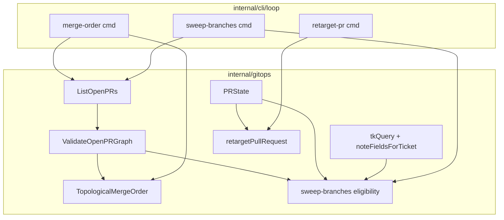
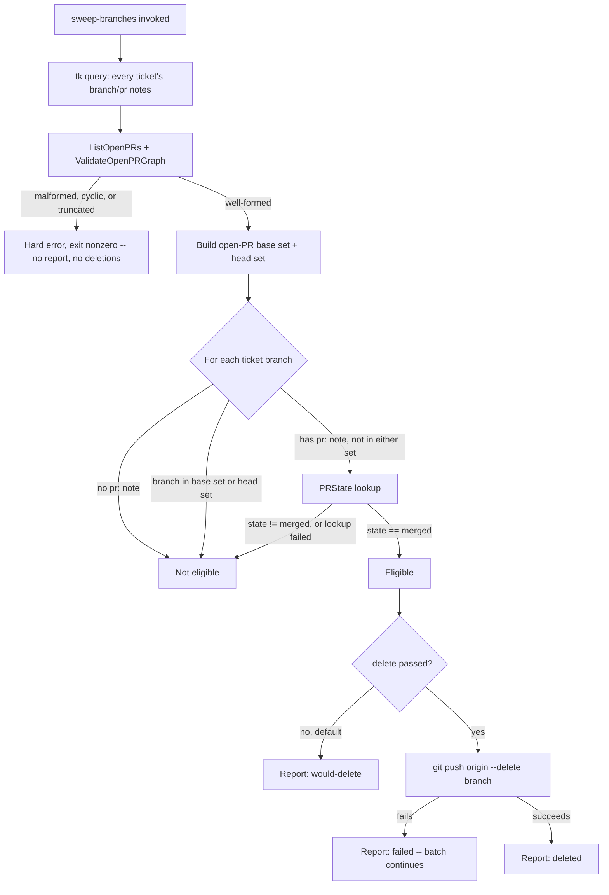

# Loop Merge-Order and Sweep-Branches Primitives - Plan

## Goal Capsule

- **Objective:** An orchestrating agent (or a human operator recovering a stuck run) can determine safe PR land order and clean up merged ticket branches in goalship's stacked-PR workflow without triggering the footgun that silently closes a still-open PR — and a stale or meaningless `retarget-pr` call is refused instead of corrupting PR state.
- **Means:** Three additions to the `loop` command group — `merge-order`, a hardened `retarget-pr`, and `sweep-branches` — built on the existing gh/glab host-tool abstraction and ticket-note mechanism (KTD2, KTD5).
- **Authority hierarchy:** GitHub issue #18 (Christophe1997/goalship) is the primary source; this plan governs implementation detail; unspecified detail is the implementer's judgment within the Scope Boundaries below.
- **Stop conditions:** If `glab mr list`'s actual output can't provide base/head-branch-equivalent fields at all (unverified locally — see Deferred Implementation Notes), stop and flag rather than guessing a shape; that would be a real dual-host support gap, not an implementation detail to default through.
- **Execution profile:** Single-session code change to an existing Go CLI. No auth/payment surfaces, no data migration. Standard TDD (red/green/refactor) applies per unit.
- **Who finishes and ships:** The implementing agent completes all five units and local verification (`go build`/`go vet`/`go test`). The user reviews the diff and ships via the repo's normal PR flow; this plan does not include that shipping tail.

---

## Product Contract

### Summary

Three additions to goalship's `loop` command group, scoped from GitHub issue #18: a read-only `merge-order` primitive that reports safe PR land order, a hardened `retarget-pr` that refuses a meaningless retarget instead of surfacing a raw host-tool error, and a `sweep-branches` primitive that safely deletes merged, no-longer-referenced ticket branches. No `loop merge` command is added. The README's `## Scope` section gains an explicit approved-extension category rather than treating this as a silent exception to its "1:1 port" charter.

### Problem Frame

Issue #18 is the CLI-side half of a human-invoked `merge-graph` flow proposed in a companion issue (`Christophe1997/agent-extentions#7`) for landing a whole stacked-PR queue; that flow isn't built yet, so these primitives currently have no live caller. The issue's own motivation is a real incident: deleting a branch that is still an open PR's base doesn't retarget that PR, it closes it — and `retarget-pr` today surfaces the host tool's raw, unhelpful "cannot change the base branch of a closed pull request" error instead of refusing before making the call.

The README's `## Scope` section states goalship is a 1:1 port of `tk` and `loop_runner.py` plus the `review` checkpoint, "not an occasion to add new ticket-tool or loop capability." Issue #18 explicitly flags itself as scope creep against that charter and leaves the decision to whoever owns the repo's scope. That decision is now made: proceed, and update the README alongside the code (see Key Decisions).

### Requirements

**Merge-order**
- R1. `goalship loop merge-order <repo-root> <host-tool>` lists every open PR/MR, builds the base→head dependency graph, and prints the topological land order as JSON.
- R2. `merge-order` hard-fails, with no output, when the open-PR listing might be truncated or the graph is malformed (a cycle, a self-referential PR, or a PR missing its base or head branch).

**Retarget-pr hardening**
- R3. `retarget-pr` refuses — a plain error, nonzero exit, no host-tool call made — when the target PR/MR is not open (closed, merged, or its state can't be determined), instead of surfacing the host tool's raw edit-rejection error.

**Sweep-branches**
- R4. `goalship loop sweep-branches <repo-root> <host-tool> [--delete]` finds every goalship-managed ticket branch (one recorded via a ticket's `branch:` note) that has a merged PR and is not any open PR's base or head branch.
- R5. Without `--delete`, sweep-branches only reports what it would delete; `--delete` is the sole gate for an actual delete — no interactive confirmation prompt.
- R6. A single branch's failed delete does not abort the batch; every candidate's outcome (would-delete / deleted / failed) is reported.
- R7. sweep-branches hard-fails before evaluating any candidate or deleting anything when the open-PR graph it reads is malformed (same condition as R2).

**Scope**
- R8. No `goalship loop merge` command is added — landing a PR stays the orchestrating agent's own action.
- R9. README's `## Scope` section documents this category of primitive as an approved extension.

### Key Decisions

- **Update the README's Scope section alongside the code** (session-settled: user-directed — chosen over treating this as a silent one-off exception, or stopping to re-brainstorm goalship's scope from scratch: the user picked documenting the extension category explicitly). Governs R9.
- **sweep-branches scopes deletion candidates to goalship's own ticket branches**, never a general remote-branch scan (session-settled: user-directed — chosen over excluding only the detected default branch, or relying solely on host branch-protection rules: the user picked the option matching the CLI's ticket-graph identity and giving the strongest built-in safety guarantee). Governs R4.

### Scope Boundaries

- No `loop merge` command (R8) — merging/landing a PR stays outside this CLI, in the orchestrating agent's own hands.
- Local branch deletion is out of scope: sweep-branches only ever deletes the remote `origin` branch; a local ref in the calling working copy is left untouched.
- A branch not recorded via some ticket's `branch:` note — `develop`, `staging`, `release/*`, or any other repo branch — is never a sweep-branches candidate, by construction (R4, and the ticket-branch-scoping Key Decision above). This is a structural exclusion, not a lower-priority concern.
- Cross-repo / fork PR heads are not modeled; same-repo stacking only, matching the rest of this codebase's branch/PR model.

#### Deferred to Follow-Up Work

- The `merge-graph` flow that actually consumes `merge-order`'s output and drives a landing sequence — issue #18 explicitly defers this; no live caller exists yet (see `agent-extentions#7`).
- A machine-parseable/structured error shape distinguishing retry-vs-stop failure modes for an unattended caller (KTD8 keeps today's plain-error convention deliberately, not as an oversight).

### Success Criteria

- `go build ./...`, `go vet ./...`, and `go test ./...` (with `-race` for `internal/gitops` and `internal/cli/loop`) pass cleanly, including all five existing `TestRetargetPullRequest_*` tests (updated in place, still green) and new coverage for all three primitives.
- `merge-order`'s JSON output is a shape stable enough to be a documented contract for the not-yet-built `merge-graph` consumer, not an implementation detail an implementer had to invent.

---

## Planning Contract

### Key Technical Decisions

- KTD1. Retarget-pr hardening reuses the existing `PRStateFunc` injection seam that `ResolveBase`/`resolveBase` (`internal/gitops/resolvebase.go`) already established: `RetargetPullRequest` becomes a thin wrapper over an unexported `retargetPullRequest(..., prState PRStateFunc)` that refuses — a plain `fmt.Errorf`, no subprocess call — when `prState` reports anything other than `"open"`, including a lookup failure (`ok == false`). Mirrors `resolveBase`'s existing treatment of an unresolvable dependency PR state: refuse rather than guess. Governs R3.
- KTD2. `merge-order` and `sweep-branches` share one `internal/gitops` primitive — `ListOpenPRs` (the gh/glab shell-out) plus `ValidateOpenPRGraph` (pure, no shell-out) — instead of two independent "list and validate the open-PR graph" implementations. `ValidateOpenPRGraph` hard-fails on a self-referential PR (`Base == Branch` on the same PR), a PR missing its base or head field, a cycle (Kahn's-algorithm-style detection over PR→PR edges), and a fan-in ambiguity: two or more open PRs sharing the same head branch **while some other open PR's base also matches that branch**. GitHub allows one head branch to be the head of multiple simultaneously-open PRs against different base branches, so this is a reachable state on `gh`, not corrupt data — it leaves `TopologicalMergeOrder` no way to pick which of the sharing PRs a dependent PR actually lands after, so it must hard-fail rather than pick one arbitrarily. (GitLab's own product limitation currently prevents this state — each branch can be the source of only one open MR at a time — so this case is gh-reachable only; `ValidateOpenPRGraph` still checks for it uniformly, since it operates on the host-agnostic `OpenPR` shape and costs nothing to check on glab input that will never trigger it.) Two open PRs sharing a head branch with **no** other PR's base referencing it is harmless — no ordering decision depends on it — and does not hard-fail; `sweep-branches`' base/head-set membership check (KTD4) is unaffected either way, since set membership doesn't care how many PRs share a branch name. Governs R1, R2, R7.
- KTD3. `ListOpenPRs`' truncation guard differs by host tool because their pagination mechanics differ — this is the one listing whose truncation is unsafe for either host, since a truncated graph corrupts both `merge-order`'s sort and `sweep-branches`' eligibility check. For `gh`: pass an explicit large `--limit` value and hard-fail if the returned count equals it (indistinguishable from "there were more"); confirmed directly (`-L/--limit`, default 30, no separate `--paginate` flag on `pr list`). For `glab`: the same requested-vs-returned-count guard does not work, because GitLab's REST API silently clamps any `--per-page` above 100 down to 100 instead of erroring — a large requested value would never equal the (capped) returned count, so that guard would never fire. `ListOpenPRs`' glab branch instead requests `--per-page 100` (GitLab's actual maximum) and loops `--page`, accumulating every page, until one returns fewer than 100 results; a runaway-loop cap (e.g. stop and hard-fail past a few hundred pages) guards against an unexpected infinite loop rather than expressing a real requirement. Governs R2, R7.
- KTD4. sweep-branches' eligibility predicate excludes a branch that is any open PR's base **or** head, not just base. A branch can carry a merged PR in its history and still be a different, currently-open PR's live head (merge once, push more, reopen from the same branch) — deleting it closes that PR exactly the way the issue's original retargeting footgun does, through a different path. Governs R4.
- KTD5. sweep-branches never lists or enumerates remote branches directly. Per the ticket-branch-scoping Key Decision, it queries every ticket (`tkQuery(repoRoot, ".")`) for a recorded `branch:` note — the same `noteFieldsForTicket`/`findTicketByBranch` mechanism `Reconcile` and `resolveBase` already use (`internal/gitops/notes.go`, `internal/gitops/reconcile.go`) — and for each candidate with a recorded `pr:` note, reuses the existing single-PR `PRState` lookup to check for `"merged"`. This removes the need for a separate "list every merged PR" host call (itself unboundedly paginated) and for a live remote-branch enumeration to keep the report fresh: a branch already gone by delete time simply surfaces as a failed per-branch delete (KTD7), not a stale-report problem. Governs R4.
- KTD6. sweep-branches' `--delete` flag (`BoolVar`, default `false`) is the sole gate for deletion — no TTY confirmation prompt anywhere in these three commands. Matches this codebase's existing `BoolVar`-default-false house style (`ledger.go`'s `ship`/`fail` flags) and reflects that the caller is unattended automation, where a blocking prompt with no TTY either hangs forever or forces a workaround that defeats the flag. Governs R5.
- KTD7. A single branch's failed `git push origin --delete` does not abort sweep-branches' batch; every candidate's outcome (`would-delete` / `deleted` / `failed`, with the git error when failed) is reported in the JSON result, mirroring `Reconcile`'s per-ticket action-list shape. The read-time open-PR-graph validity check (KTD2, KTD3) remains the one whole-command hard failure. Governs R6.
- KTD8. All three primitives' hard failures (unsupported host tool, malformed graph, retarget-pr's refusal) stay a plain `fmt.Errorf` surfaced through Cobra's existing "Error: ..." plus nonzero-exit path, matching every other hard error in `internal/gitops` today. No new structured/machine-parseable error shape is introduced for this issue — an orchestrating agent distinguishes failure modes by message text, same as it already must for every other command in this CLI. A distinguishable shape was considered and set aside (see Deferred to Follow-Up Work). Governs R2, R3, R7.
- KTD9. `merge-order`'s output is an ordered JSON array of `{number, url, branch, base}` objects (one per open PR, in land order) via the existing `printJSON` convention — richer than a bare PR-number list, cheaper for a future consumer to work with than a full dependency-edge graph. Governs R1.

### High-Level Technical Design

**Component relationships.** `ListOpenPRs`/`ValidateOpenPRGraph` is the shared foundation both new commands build on; `retargetPullRequest`'s hardening is independent, reusing only the pre-existing `PRState`/`PRStateFunc` seam.

**sweep-branches eligibility.** The decision flow a candidate ticket branch passes through, combining the graph validity gate, the ticket-branch scope, and the base/head exclusion (KTD4):

### Risks & Dependencies

- `glab mr list`'s JSON output schema (the exact field names for a merge request's source/target branch) isn't documented in its manual page and isn't independently verifiable here (`glab` isn't installed in this dev environment) — only its flags are confirmed. GitLab's REST API uses `source_branch`/`target_branch`; `glab mr list --output json` is expected to mirror that naming, but this is an expectation, not a confirmed fact — verify against a real `glab mr list -F json` response before implementing `ListOpenPRs`' glab branch (see Deferred Implementation Notes).
- A TOCTOU window exists between listing the open-PR graph and acting on it (retarget-pr's lookup-then-edit, sweep-branches' list-then-delete) — no lock exists anywhere in `internal/gitops` today, and this plan doesn't introduce one. Accepted as consistent with this codebase's current risk posture; a failed action surfaces as an ordinary error or a per-branch `failed` outcome, not silent corruption.
- `sweep-branches` is the first consumer to attach a destructive action (branch deletion) to `tk`'s ticket-note resolution (`tkQuery`/`noteFieldsForTicket`) — a mechanism this repo has needed multiple recent fixes for around `TICKETS_DIR` override handling and path containment (see recent history: `aba7120`, `2793a77`, `9fbc464`). A future regression there now has branch-deletion consequences, not just a stale read; no new safeguard is proposed beyond the existing eligibility checks (KTD4, KTD5).

### Deferred Implementation Notes

- Exact `glab mr list -F json` field names for the source/target branch, MR number, and URL (source: `glab`'s manual confirms the flags — `-p/--page`, `-P/--per-page`, `-F/--output`, `-s/--source-branch`, `-t/--target-branch` — but not the JSON schema; `gh`'s equivalent is fully confirmed, see KTD3).
- `glab` addresses a merge request by its project-scoped `iid`, not GitLab's global `id` — `OpenPR.Number` (and any argv built from it, e.g. `PRState`/`retargetPullRequest`'s `prRef`) must map to `iid` for the glab host, not `id`, when the JSON field-name verification above runs.
- Exact Go/JSON field names for `sweep-branches`' per-branch report struct — this plan fixes the shape's meaning (ticket ID, branch, PR ref, eligibility, deleted/failed outcome), not its literal field spelling.

---

## Implementation Units

### U1. Shared open-PR graph primitive

- **Goal:** Add `ListOpenPRs` (the gh/glab shell-out, with a truncation guard) and `ValidateOpenPRGraph` (pure validation) as the shared foundation `merge-order` and `sweep-branches` both build on.
- **Requirements:** R1, R2, R7 (KTD2, KTD3)
- **Dependencies:** none
- **Files:**
  - `internal/gitops/prgraph.go` (new)
  - `internal/gitops/prgraph_test.go` (new)
- **Approach:**
  1. Define `OpenPR{Number int; URL string; Branch string; Base string}`.
  2. `ListOpenPRs(repoRoot, hostTool string) ([]OpenPR, error)`: for `gh`, a `runContext`-backed `gh pr list --state open --json number,url,baseRefName,headRefName --limit <N>` call; hard-fail if the result count equals the requested limit. For `glab`, loop `glab mr list --output json --per-page 100 --page <N>` (confirmed flags — KTD3) starting at page 1, accumulating results, until a page returns fewer than 100; confirm the JSON field names — including the `iid`-vs-`id` distinction — against a real response before finalizing (Deferred Implementation Notes).
  3. `ValidateOpenPRGraph(prs []OpenPR) error`: pure, no shell-out. Detects a self-loop (`Base == Branch` on one PR), an empty base or branch field, a cycle (Kahn's-algorithm-style over PR→PR edges where `X` depends on `Y` iff `X.Base == Y.Branch`), and a fan-in ambiguity (KTD2: two or more open PRs sharing a head branch that some other open PR's base also references). Returns a `fmt.Errorf` naming the specific malformed condition.
- **Technical design:** Edge model — directional guidance, not implementation spec: node = one `OpenPR`; a directed edge `X → Y` exists when `X.Base == Y.Branch` (X is stacked on Y). A cycle in this graph, a node with `Base == Branch`, or a base branch matched by more than one other open PR's `Branch` (fan-in ambiguity, KTD2) is unsortable and must hard-fail before any ordering or eligibility logic runs.
- **Patterns to follow:** `internal/gitops/pr.go`'s `FindOpenPRForBranch`/`CreatePullRequest` for the `runContext`/argv/hostTool-switch shape; `internal/gitops/resolvebase.go`'s `hostToolTimeout` var (reuse, don't redeclare).
- **Execution note:** Implement `ValidateOpenPRGraph` test-first from hand-built `[]OpenPR` fixtures — it's pure and the fastest unit to prove correct in isolation, before wiring in the real gh/glab call.
- **Test scenarios:**
  - Happy path: `ListOpenPRs` against a fake `gh` returning 2 well-formed PRs parses into `[]OpenPR` with the expected argv.
  - Happy path: `ListOpenPRs` against a fake `glab` returning 2 well-formed MRs parses into `[]OpenPR` with the expected argv, once the JSON field names are confirmed against a real response (Deferred Implementation Notes).
  - Edge case (`gh`): `ListOpenPRs` returns exactly the requested `--limit`'s worth of results → truncation-guard error.
  - Edge case (`glab`): a page returns exactly 100 results (GitLab's per-page maximum) → `ListOpenPRs` requests the next page instead of stopping; a page returning fewer than 100 ends pagination and returns the accumulated results with no error.
  - Edge case: `ListOpenPRs` returns zero open PRs → empty slice, no error.
  - Error path: the gh/glab call itself fails (nonzero exit / timeout) → wrapped `*ExitError` propagates.
  - Happy path: `ValidateOpenPRGraph` on a 3-PR linear stack → no error.
  - Edge case: `ValidateOpenPRGraph` on a 2-PR cycle → error naming the cycle.
  - Edge case: `ValidateOpenPRGraph` on a self-referential PR (`Base == Branch`) → error.
  - Edge case: `ValidateOpenPRGraph` on a PR with an empty base or branch field → error.
  - Edge case (KTD2): `ValidateOpenPRGraph` on two different open PRs sharing the same head branch, with no other PR's base referencing that branch → no error, not treated as malformed.
  - Edge case (KTD2): `ValidateOpenPRGraph` on two different open PRs sharing the same head branch, where a third PR's base matches that branch → error naming the fan-in ambiguity.
- **Verification:** `go test ./internal/gitops/...` passes; every branch of `ValidateOpenPRGraph` and the truncation guard is covered.

### U2. `merge-order` command

- **Goal:** Land-order reporting for the open-PR stack via a new `goalship loop merge-order` command.
- **Requirements:** R1, R2 (KTD2, KTD3, KTD9)
- **Dependencies:** U1
- **Files:**
  - `internal/gitops/prgraph.go` (add `TopologicalMergeOrder`)
  - `internal/gitops/prgraph_test.go`
  - `internal/cli/loop/mergeorder.go` (new)
  - `internal/cli/loop/mergeorder_test.go` (new)
  - `internal/cli/loop/loop.go` (register `NewMergeOrderCmd()`)
- **Approach:**
  1. `TopologicalMergeOrder(prs []OpenPR) ([]OpenPR, error)` composes `ValidateOpenPRGraph` then a Kahn's-algorithm sort: roots (PRs whose `Base` isn't any open PR's `Branch`) land first.
  2. `NewMergeOrderCmd()`: `Use: "merge-order <repo-root> <host-tool>"`, `Args: cobra.ExactArgs(2)`; calls `ListOpenPRs` then `TopologicalMergeOrder`, prints the KTD9 shape via `printJSON`.
  3. Register the command in `internal/cli/loop/loop.go`'s `NewCmd()`.
- **Patterns to follow:** `internal/cli/loop/preflight.go`'s `NewPreflightCmd`/`printJSON` pairing for the Cobra-layer shape; `internal/cli/loop/findpr.go` for the thin-`RunE` convention.
- **Execution note:** Implement `TopologicalMergeOrder` test-first from hand-built `[]OpenPR` fixtures — no fake host tool needed for the sort itself; only the Cobra-layer test needs one.
- **Test scenarios:**
  - Happy path: a 3-PR linear stack sorts bottom-first (root, then its dependent, then the top).
  - Happy path: 2 independent stacks (no shared edges) both appear correctly ordered.
  - Edge case: zero open PRs → empty order, exit 0, not an error.
  - Error path: a cyclic graph → the `ValidateOpenPRGraph` error propagates, no partial order returned.
  - Error path (KTD2): two open PRs share a head branch that a third PR's base also references (fan-in ambiguity) → the `ValidateOpenPRGraph` error propagates, no partial order returned.
  - Integration: `merge-order` against a fake `gh` returning 2 PRs prints the expected JSON array and exits 0.
  - Integration: fake `gh` returns a malformed/cyclic set → command exits nonzero, no stdout JSON.
- **Verification:** `go test ./internal/gitops/... ./internal/cli/loop/...` passes; `goalship loop merge-order --help` shows the documented usage.

### U3. Hardened `retarget-pr`

- **Goal:** `retarget-pr` refuses a meaningless or unresolvable retarget instead of surfacing the host tool's raw error.
- **Requirements:** R3 (KTD1)
- **Dependencies:** none
- **Files:**
  - `internal/gitops/pr.go` (modify `RetargetPullRequest`)
  - `internal/gitops/pr_test.go` (update the 5 existing `TestRetargetPullRequest_*` tests — `_GH_Argv`, `_Glab_Argv`, `_NonzeroExit_ReturnsExitError`, `_UnsupportedHostTool_ErrorsWithoutShellingOut`, `_TimeoutKillsHungHostTool` — add new ones)
- **Approach:**
  1. `RetargetPullRequest(repoRoot, hostTool, prRef, newBase string) error` becomes a thin wrapper: `return retargetPullRequest(repoRoot, hostTool, prRef, newBase, PRState)`.
  2. New unexported `retargetPullRequest(..., prState PRStateFunc) error`: check `hostTool` validity first, preserving the existing unsupported-host-tool error and its no-shell-out guarantee; then call `prState(repoRoot, hostTool, prRef)`. When `!ok` or `state != "open"`, return a plain `fmt.Errorf` naming the refusal reason and make no host-tool edit call; otherwise run the existing gh/glab edit call unchanged.
  3. Extend the fake-binary test helper (`captureArgvHostTool`/`withFakeHostTool`, `internal/gitops/pr_test.go`) to dispatch a response per subcommand rather than one flat script, since the hardened function now makes two calls (`view`/`mr view`, then `edit`/`mr update`). `TestRetargetPullRequest_TimeoutKillsHungHostTool`'s fake binary must answer the state-lookup subcommand with an immediate open state and hang only on the edit subcommand, so it keeps proving the edit-call watchdog rather than silently shifting to test the lookup call instead.
- **Patterns to follow:** `internal/gitops/resolvebase.go`'s `resolveBase(..., prState PRStateFunc)` composition — the direct precedent for this "look up state, then act" shape.
- **Execution note:** This modifies existing, tested behavior. Start by updating all 5 existing `TestRetargetPullRequest_*` tests to the two-call fake-binary shape (proving current success/failure paths still hold, including the timeout test's edit-call-only hang), then add the new refusal tests.
- **Test scenarios:**
  - Happy path: target PR is open → precondition passes, the existing edit call fires with unchanged argv (gh and glab — regression coverage for the existing argv-asserting tests).
  - Edge case: target PR state is `closed` → refused, no edit call made.
  - Edge case: target PR state is `merged` → refused, same as closed.
  - Error path: the state lookup itself fails (`ok == false`) → refused, no edit call made.
  - Error path: the state-lookup call itself hangs past the host-tool timeout → refused via the plain-error path (not `*ExitError`), since `PRState`'s `runUnchecked` collapses a timeout into an ordinary lookup failure — `TestRetargetPullRequest_TimeoutKillsHungHostTool` continues to prove the edit-call watchdog specifically, not this path.
  - Error path (unchanged): the host-tool edit call fails after passing the precondition → existing `*ExitError` behavior still holds.
  - Error path (unchanged): unsupported host tool → existing errors-without-shelling-out behavior still holds.
- **Verification:** `go test ./internal/gitops/...` passes, including all `TestRetargetPullRequest_*` cases (updated and new).

### U4. `sweep-branches` command

- **Goal:** Safe, ticket-scoped batch cleanup of merged, no-longer-referenced branches via a new `goalship loop sweep-branches` command.
- **Requirements:** R4, R5, R6, R7 (KTD4, KTD5, KTD6, KTD7)
- **Dependencies:** U1
- **Files:**
  - `internal/gitops/sweepbranches.go` (new)
  - `internal/gitops/sweepbranches_test.go` (new)
  - `internal/cli/loop/sweepbranches.go` (new)
  - `internal/cli/loop/sweepbranches_test.go` (new)
  - `internal/cli/loop/loop.go` (register `NewSweepBranchesCmd()`)
- **Approach:**
  1. Define a per-branch report type (ticket ID, branch, PR ref, eligibility, and a would-delete/deleted/failed outcome with an error string when failed).
  2. `SweepBranches(repoRoot, hostTool string, execute bool) ([]SweepCandidate, error)`:
     - Query every ticket (`tkQuery(repoRoot, ".")`) and its `branch`/`pr` note fields (`noteFieldsForTicket`).
     - Call `ListOpenPRs` + `ValidateOpenPRGraph` once; a graph error propagates immediately, before any candidate is evaluated.
     - Build the open-PR base-branch and head-branch sets from the validated list.
     - Per candidate (has both a `branch` and a `pr` note): skip if the branch is in either set; otherwise look up `PRState` and treat `"merged"` as eligible, anything else (including a lookup failure) as not eligible.
     - When `execute`, run `git push origin --delete <branch>` per eligible candidate, guarded by `rejectFlagLikeRef`; continue past a per-branch failure and record each outcome.
  3. `NewSweepBranchesCmd()`: `Use: "sweep-branches <repo-root> <host-tool>"`, a `--delete` `BoolVar` flag defaulting `false`; calls `SweepBranches` and prints the report via `printJSON`.
  4. Register the command in `internal/cli/loop/loop.go`.
- **Technical design:** Governed by the sweep-branches eligibility flowchart in High-Level Technical Design above.
- **Patterns to follow:** `internal/gitops/reconcile.go`'s `Reconcile`/`findTicketByBranch` for the tk-query-then-note-fields shape; `internal/gitops/refname.go`'s `rejectFlagLikeRef` guard, applied here since the branch name comes from ticket-note data, not a literal.
- **Execution note:** Implement the eligibility predicate test-first as a pure function over a hand-built candidate list plus open-PR sets, before wiring in the real `tkQuery`/`PRState`/delete calls.
- **Test scenarios:**
  - Happy path: a ticket branch with a merged PR, not in any open PR's base/head set → eligible, reported `would-delete` in report-only mode.
  - Happy path (KTD4): a ticket branch with a merged PR that is a *different*, currently-open PR's head branch (reused-after-merge case) → not eligible.
  - Happy path: a ticket branch with a merged PR that is an open PR's base branch → not eligible.
  - Edge case: a ticket with a `branch` note but no `pr` note → not eligible.
  - Edge case: a ticket branch whose PR state is `open` or `closed` (not merged) → not eligible.
  - Error path: the `PRState` lookup fails for one candidate (`ok == false`) → that candidate is not eligible; the run as a whole does not hard-fail.
  - Error path: the shared open-PR graph is malformed/cyclic → `SweepBranches` returns a hard error before evaluating any candidate or deleting anything.
  - Execute-mode happy path: `--delete` passed, one eligible branch, the delete succeeds → reported `deleted`.
  - Execute-mode error path: `--delete` passed, two eligible branches, one delete fails → that branch reports `failed` with the error; the other still reports `deleted` (KTD7).
  - Integration: report-only is the default with no `--delete` flag — no `git push` delete call is ever made.
- **Verification:** `go test ./internal/gitops/... ./internal/cli/loop/...` passes; a report-only run against a fixture with one eligible and one ineligible ticket branch names exactly the eligible one.

### U5. README Scope section update

- **Goal:** Document this work's category as an approved extension to goalship's charter, not a silent exception.
- **Requirements:** R9 (the README Key Decision above)
- **Dependencies:** U2, U4 (describes what actually shipped)
- **Files:**
  - `README.md`
- **Approach:** Extend the existing `## Scope` section to name this category explicitly — safety/graph primitives that operate over the existing loop mechanics' PR and branch state (`merge-order`, hardened `retarget-pr`, `sweep-branches`) — as an approved addition alongside the `review` checkpoint, while keeping the "not an occasion to add new ticket-tool or loop capability beyond that" sentence intact for anything outside this category. Do not weaken the existing "Out of scope" bullets.
- **Test scenarios:** Test expectation: none -- pure documentation change, no behavior to verify.
- **Verification:** README's `## Scope` section reads accurately against what U1-U4 actually shipped.

---

## Verification Contract

- `go build ./...` and `go vet ./...` — applies to every unit, must stay clean throughout.
- `go test ./internal/gitops/... ./internal/cli/loop/...` (add `-race`) — the two packages this work touches; run after each unit.
- `go test ./...` — full-repo regression pass before calling the plan done, confirming no other package's tests broke (e.g. `internal/cli/tk`'s parity tests, which read the same ticket-note mechanism U4 reuses).

## Definition of Done

- All five units complete; `go build ./...`, `go vet ./...`, and `go test ./...` (with `-race` on the touched packages) pass cleanly.
- `merge-order`, `retarget-pr` (hardened), and `sweep-branches` are all registered in `internal/cli/loop/loop.go` and appear under `goalship loop --help`.
- No `goalship loop merge` command exists anywhere in the CLI.
- README's `## Scope` section is updated and consistent with what shipped.
- No half-explored `glab` pagination/field code is left committed if the Deferred Implementation Notes' verification step changes the planned shape — the final `glab` argv reflects what was actually confirmed, not an abandoned guess.

---

## Sources & Research

- GitHub issue [Christophe1997/goalship#18](https://github.com/Christophe1997/goalship/issues/18) — primary source for all three primitives' scope and the explicit charter tension.
- Companion issue `Christophe1997/agent-extentions#7` — the human-invoked `merge-graph` flow these primitives serve; not built yet, no live caller.
- `internal/gitops/resolvebase.go`'s `resolveBase(..., PRStateFunc)` — precedent for KTD1's injection seam.
- `internal/gitops/reconcile.go`'s `Reconcile`/`findTicketByBranch`, `internal/gitops/notes.go`'s `noteFieldsForTicket` — precedent for KTD5's ticket-note query mechanism.
- `internal/cli/loop/ledger.go`'s `ship`/`fail` `BoolVar` flags — precedent for KTD6's flag convention.
- `gh pr list --help` (gh 2.99.0, run directly in this environment) — confirms KTD3's `gh` pagination behavior (`-L/--limit`, default 30).
- `glab-mr-list(1)` manual (man.archlinux.org, fetched during deepening) — confirms KTD3's `glab` pagination flags (`-p/--page`, `-P/--per-page`, default 1/30) and output flag (`-F/--output`), though not its JSON field names (see Deferred Implementation Notes).
- GitHub Docs on pull requests and base/head branches, corroborated during `ce-doc-review` — confirms a single head branch can be the head of multiple simultaneously-open PRs against different base branches on GitHub, correcting KTD2's original rationale. GitLab issue [gitlab-org/gitlab#29041](https://gitlab.com/gitlab-org/gitlab/-/issues/29041) confirms GitLab currently disallows the equivalent (one open MR per source branch), so KTD2's fan-in case is gh-reachable only.
- GitLab issue [gitlab-org/gitlab#510864](https://gitlab.com/gitlab-org/gitlab/-/issues/510864) and GitLab's REST API pagination docs, corroborated during `ce-doc-review` — confirm `per_page` is silently clamped to 100 rather than erroring, informing KTD3's glab pagination strategy.
