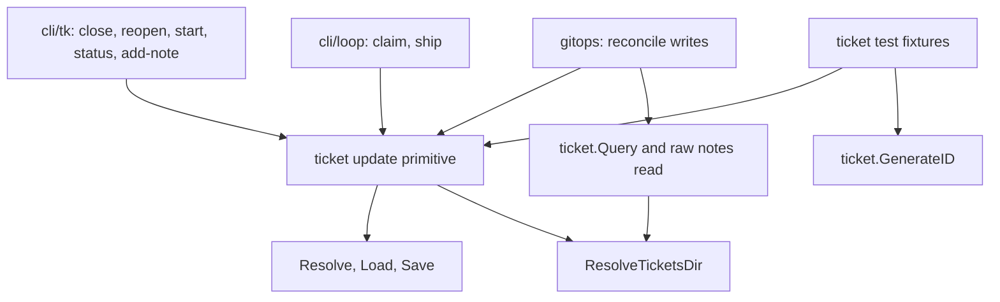

# Drop the bash tk Dependency from the Loop and Its Tests - Plan

## Goal Capsule

- **Objective:** A machine with `git` and `gh`/`glab` but no bash `tk` runs the whole goalship loop, and runs goalship's own test suite, without a `tk`-related failure.
- **Means:** The loop's git mechanics read and write tickets in-process through `internal/ticket`, and tests build their tickets the same way (KTD1, KTD2, KTD6).
- **Authority:** Requirements win on behavior; a KTD wins on mechanism within its cited requirements; a unit overrides neither.
- **Stop conditions:** Stop and ask if a characterization test shows the in-process path differs from bash `tk` in a way KTD3 and KTD4 do not cover, or if the suite still needs a non-Go tool other than `git` after U5.
- **Execution profile:** Test-first (red, green, refactor) with one commit per unit, each through the repo's conventional-commit flow with no AI co-author trailer. (session-settled: user-approved — chosen over one squashed change: each step stays reviewable and revertable.)
- **Ships:** `ce-work` implements; the user reviews and pushes.

---

## Product Contract

### Summary

Port `internal/gitops` and the loop's preflight off the bash `tk` binary onto `internal/ticket`, and convert the test fixtures that shell out to `tk` to in-process helpers. After it lands, only the two bash-`tk` parity tests can use a real `tk`, and both skip when it is absent.

### Problem Frame

`internal/gitops` was written on 2026-09-03, the same day as the `goalship tk` port, so it shelled out to the installed `tk` rather than depend on work that had not landed. `internal/gitops/notes.go` still says so. The port has since shipped and `loop claim` and `loop ship` already use it in-process, but the gitops read and reconcile paths and `loop preflight` never moved.

The first release workflow run on a stock GitHub runner made the cost visible: dozens of gitops and loop tests failed because `tk` was not on `PATH`. A user without bash `tk` also cannot pass `loop preflight` even though `goalship tk` exists, which contradicts the README ("replaces bash `tk`") and the original CLI plan's "no lingering bash dependency" decision.

### Key Decisions

- KD1. `loop preflight` stops checking for `tk` on `PATH`, and nothing replaces the check. Governs R2. (session-settled: user-approved — chosen over swapping it for a `goalship`-on-PATH check: goalship is the process running, so that check is vacuous.)
- KD2. gitops finds the tickets directory by the rule `goalship tk`, `loop claim`, and `loop ship` already use, not by bash `tk`'s walk-up from the working directory. Governs R3. (session-settled: user-approved — chosen over mimicking the walk-up: the explicit rule already has a `TICKETS_DIR` test suite and callers always hold an explicit repo root.)

### Requirements

**Runtime behavior**

- R1. `resolve-base`, `run-branch`, `sweep-branches`, and `reconcile` read tickets and their notes, and `reconcile` closes, reopens, and annotates tickets, through `internal/ticket` in-process with no `tk` subprocess.
- R2. `loop preflight` does not require `tk` on `PATH`.
- R3. gitops resolves the tickets directory as the `TICKETS_DIR` override when set, otherwise `<repo-root>/.tickets`, and never searches parent directories.
- R4. For every input the existing tests cover, results are unchanged: the same reconcile actions, the same note contents, the same ticket-file effects. An unknown or ambiguous ticket reference still fails loudly.
- R5. A ticket that the query lists but whose frontmatter is malformed does not stop notes being read for the other tickets; note reads keep the tolerance `tk show` had.

**Test and CI readiness**

- R6. Every test that needs a ticket builds it in-process. Only the two bash-`tk` parity tests may use a real `tk`, and they skip when it is absent.
- R7. With `tk` absent from `PATH`, the suite has no `tk`-related failure. On Linux the two host-tool timeout tests tracked in issue #29 may still fail.

### Success Criteria

- A full suite run on a `PATH` without `tk` finishes with no `tk not found` or `tk … failed (exit -1)` failure.
- No non-test Go file under `internal/` starts a `tk` subprocess or looks for `tk` on `PATH`.
- For every input the existing tests cover (R4), the goalship loop behaves as before on a machine that does have `tk`, apart from the deliberate changes: no parent-directory walk-up (KD2), note and status written in one save (KTD8), and the strict-`Load` failure on malformed frontmatter accepted under Risks & Dependencies.

### Scope Boundaries

- The parity tests against real bash `tk` stay as they are.
- Migrating existing ticket IDs to the new ID shape is outside this plan, as in the original CLI plan.
- The sibling `agent-extentions` skill still calls bare `tk` in its own docs; that repository is not touched here.

#### Deferred to Follow-Up Work

- A plain CI test workflow. It needs this plan and issue #29 done first; adding it is a separate change. (session-settled: user-approved — chosen over folding the workflow into this plan: it is a distinct deliverable and cannot pass on Linux until #29 is resolved.)
- Issue #29 (https://github.com/Christophe1997/goalship/issues/29): `TestCreatePullRequest_TimeoutKillsHungHostTool` and `TestListOpenPRs_Glab_TimeoutKillsHungHostTool` take 5s and fail on Ubuntu. The issue carries the hypothesis and fix directions.

---

## Planning Contract

### Key Technical Decisions

- KTD1. Port gitops onto `internal/ticket` instead of installing `tk` in CI. (session-settled: user-approved — chosen over fetching the pinned wedow/ticket script in the workflow: that stopgap leaves CI depending on the tool goalship replaces, and `goalship tk` already covers every operation gitops needs.)
- KTD2. Add one resolve-load-mutate-save primitive to `internal/ticket` (working name `Update`) and route the single-ticket status and note writers through it. Four copies of that sequence already exist in `internal/cli/tk/status.go`, `internal/cli/tk/addnote.go`, `internal/cli/loop/claim.go`, and `internal/cli/loop/ship.go`; porting gitops's three writes (close, reopen, add-note) without it would make seven. The other load-and-save sites (dependency and link edits in `internal/cli/tk`, ticket creation and beads migration, and the review server's ticket edit handler) do different work and keep their own sequences in this plan. It extends the approved move of the status change into `internal/ticket`. The mutation callback lets `ship` keep its note-plus-close in one save. A gitops-local set of helpers was rejected for duplicating the sequence again; a bake-off did not qualify, since either shape is cheap to reverse.
- KTD3. Read a ticket's notes from the raw ticket file (resolve the ID, read the file, reuse `notesSection` and the marker parsing), not through strict `ticket.Load`. `tk show` printed the raw file. `Load` hard-errors on malformed frontmatter while `ticket.Query`, which lists the tickets, tolerates it, so strict loading would let one malformed ticket abort every reconcile and sweep. Governs R5.
- KTD4. gitops resolves the tickets directory with `ticket.ResolveTicketsDir(repoRoot)`. Governs R3 through KD2.
- KTD5. Keep `jqString` escaping when a ticket ID is spliced into a query filter. `ticket.Query` parses the filter with gojq, so the injection fix in the gitops history still applies. Rename the `tk`-prefixed wrappers so their names stop pointing at a binary.
- KTD6. Fixtures move to a small test-support package under `internal/ticket` used by both gitops and loop tests, replacing two duplicated sets of `tk*` helpers. Creating tickets stays out of the production package: only tests need it, and `runCreate` lives in the Cobra layer. Fixture start, close, note, and dependency operations are built on the KTD2 primitive.
- KTD7. Replace the fake-`tk` shell wrapper that fails the nth `show` call (`withTkShowFailingFromCall`) with a package-level seam on the note-read step, reassigned in tests the way `hostToolTimeout` already is. Call order over generated IDs is not controllable, which is why the old helper counted calls. The abort assertion then unwraps to the injected error instead of an `*ExitError` whose argv names `show`.
- KTD8. For `reconcile`'s note-then-close and note-then-reopen outcomes, use one update per ticket so the note and the status land in one save, as `loop ship` already does. This changes crash behavior only in the safe direction.

### High-Level Technical Design

After the change every status and note writer converges on one primitive, and gitops depends on `internal/ticket` for both reads and writes.

### Risks & Dependencies

| Risk | Handling |
|---|---|
| `Update` uses strict `Load`, so `reconcile` now fails on a malformed-frontmatter ticket where bash `tk`'s in-place edit did not. | Accept it: `goalship tk close` already behaves this way. Add a test that the failure is a clear error and leaves the file byte-identical. |
| Load-modify-save is unlocked, so a concurrent writer such as the review server can lose an update. | Unchanged exposure: bash `tk`'s `sed` edit was unlocked too. `Save` is atomic, so no reader sees a torn file. |
| Fixture IDs now use the new ID shape, and a test might hard-code an old-shape ID. | Check during U2; the suite stays green with `tk` installed until U4, which surfaces any such case. |
| Until U5, mid-sequence commits still need `tk` for some tests. | Acceptable: no CI test workflow exists yet, and each unit keeps the suite green on a machine that has `tk`. |
| The two timeout tests in issue #29 may still fail on Linux. | Out of scope by decision; R7 names the exception. |

No new dependencies: `gojq` is already a dependency of `internal/ticket`.

---

## Implementation Units

### U1. Add the update primitive and route the existing writers through it

- **Goal:** One primitive that resolves an ID, loads, applies a mutation, saves, and returns the resolved ID; the four existing copies adopt it with no behavior change.
- **Requirements:** R4 (groundwork for R1). KTD2.
- **Dependencies:** none.
- **Files:**
  - `internal/ticket/update.go` (new), `internal/ticket/update_test.go` (new)
  - `internal/cli/tk/status.go`, `internal/cli/tk/addnote.go`
  - `internal/cli/loop/claim.go`, `internal/cli/loop/ship.go`
  - Existing tests in `internal/cli/tk` and `internal/cli/loop` as the regression net
- **Approach:**
  - The primitive returns the resolved ID, which `tk status` and `tk add-note` print.
  - `ErrNotFound`, `ErrAmbiguous`, and load or save errors stay unwrappable; each caller keeps its own message prefix.
  - `runShip` does its note and its close in one mutation, preserving the single round trip.
  - Status validation stays in the `tk` command layer.
- **Execution note:** Write the primitive's tests first. The four call-site migrations are protected by existing tests, which must pass untouched.
- **Patterns to follow:** `runStatus` in `internal/cli/tk/status.go`, `recordClaimNote` in `internal/cli/loop/claim.go`, `runShip` in `internal/cli/loop/ship.go`.
- **Test scenarios:**
  - A partial ID applies the mutation, saves, and returns the full resolved ID.
  - A mutation that adds a note and sets a status leaves both in the saved file after one call.
  - A substring ID matching two tickets returns `ErrAmbiguous` and leaves both files unchanged.
  - An ID matching nothing returns `ErrNotFound`.
  - A ticket with malformed frontmatter returns the load error and the file bytes are identical afterward.
  - Integration: the existing `tk` command, `loop claim`, and `loop ship` tests pass unchanged.
- **Verification:** New primitive tests and all existing `internal/cli/tk` and `internal/cli/loop` tests pass with `tk` still installed.

### U2. Build ticket fixtures in-process

- **Goal:** Tests create, start, close, annotate, and link tickets without running `tk`.
- **Requirements:** R6. KTD6.
- **Dependencies:** U1.
- **Files:**
  - `internal/ticket/tickettest/tickettest.go` (new), `internal/ticket/tickettest/tickettest_test.go` (new)
  - `internal/gitops/helpers_test.go`
  - `internal/cli/loop/branch_test.go`, `internal/cli/loop/reconcile_test.go` (every other test file in both packages calls these helpers by name, about 170 call sites, and needs no edit)
- **Approach:**
  - Resolve the tickets directory with `ResolveTicketsDir` so the existing `TICKETS_DIR` tests keep working; create the directory when absent.
  - Create through `GenerateID` plus a `Ticket` value; start, close, note, and dependency operations go through the U1 primitive.
  - Reduce each package's `tk*` helpers (`tkCreate`, `tkStart`, `tkAddNote`, `tkDep`, `tkClose`) to thin wrappers over the fixture package, keeping their names, so the exec-based duplicate logic goes away without rewriting every call site.
  - Leave `pathWithoutHostTools` unchanged here: the reconcile tests that use it still reach `tk` through production code until U3.
  - Production code still shells out to `tk` at this point, which doubles as a compatibility check that fixture-made tickets stay readable by bash `tk`.
- **Execution note:** Give the fixture package its own tests first, then swap one package's helper bodies at a time with the suite green throughout.
- **Patterns to follow:** `runCreate` and `buildCreateBody` in `internal/cli/tk/create.go` for the minimal file shape; `t.TempDir()` and `t.Setenv` use in the existing fixtures.
- **Test scenarios:**
  - A created ticket loads with strict `Load` and appears in `Query` with status `open` and type `task`.
  - Two tickets created back to back get distinct IDs.
  - Start, close, and reopen fixtures set the expected statuses.
  - The note fixture output is read back by the gitops notes parser as one note with the given text.
  - The dependency fixture adds a dependency once and does not duplicate it on a repeat call.
  - With `TICKETS_DIR` set, the ticket lands in that directory, and the directory is created if missing.
- **Verification:** The whole suite passes with `tk` installed; no test file except the two parity tests calls `tk` directly.

### U3. Port gitops reads to in-process

- **Goal:** `resolve-base`, `run-branch`, `sweep-branches`, and the read half of `reconcile` query tickets and read notes without `tk`.
- **Requirements:** R1 (reads), R3, R4, R5. KTD3, KTD4, KTD5, KTD7, KD2.
- **Dependencies:** U2.
- **Files:**
  - `internal/gitops/notes.go`, `internal/gitops/resolvebase.go`, `internal/gitops/sweepbranches.go`, `internal/gitops/reconcile.go`, `internal/gitops/runbranch.go`
  - `internal/gitops/notes_test.go`, `internal/gitops/resolvebase_test.go`, `internal/gitops/sweepbranches_test.go`, `internal/gitops/reconcile_test.go`, `internal/cli/loop/reconcile_test.go`
- **Approach:**
  - Replace the query wrapper with a call to `ticket.Query` over the resolved tickets directory, keeping the per-line JSON decode and `jqString` escaping.
  - Remove the `tk` symlink from both packages' `pathWithoutHostTools`, keeping the isolation of `gh`/`glab`; the read-only reconcile tests that use it then run without `tk`.
  - Read notes from the raw ticket file after `ticket.Resolve`, feeding the existing `notesSection` and marker parsing.
  - Add the note-read seam and repoint the sweep abort tests at it; delete `withTkShowFailingFromCall` once nothing uses it.
  - Update the stale "shells out because the port has not landed" comment.
- **Execution note:** Start with red tests that run each read-path scenario on a `PATH` without `tk`. Add the `TICKETS_DIR` and no-walk-up tests before deleting the shell-out, so the resolution rule is pinned first.
- **Patterns to follow:** `hostToolTimeout` as the reassignable-seam precedent in `internal/gitops`; `noteFieldsForTicket` tests in `internal/gitops/notes_test.go`.
- **Test scenarios:**
  - Covers R1. `resolve-base` for a ticket whose dependency carries `branch:` and `pr:` notes returns the same base as today with no `tk` on `PATH`.
  - Two structured notes on one ticket merge oldest to newest, with the later value winning.
  - A ticket with no `## Notes` heading yields no notes; a notes section followed by another `## ` heading stops at that heading.
  - Covers R3. A `TICKETS_DIR` outside the repo root is honored for queries and note reads.
  - Covers R3. A `.tickets` directory that exists only in a parent of the repo root is not found.
  - A ticket ID containing a quote, a backslash, and `\(` is escaped and does not change the filter's meaning.
  - Covers R5. A malformed-frontmatter ticket is still listed by the query and its notes are still read, while other tickets in the same run are processed.
  - An unknown dependency ID makes `resolve-base` fail loudly; an ambiguous substring ID also fails.
  - `sweep-branches --delete` aborts after deleting the first branch when the second branch's note read fails; the error names the deleted branch and unwraps to the injected failure.
  - Integration: the reconcile outcomes that only read (retry PR creation, no recoverable state, auth failure) pass with `tk` absent; outcomes that also write wait for U4.
- **Verification:** The gitops read-path tests pass on a `PATH` without `tk`; the sweep and reconcile suites pass with `tk` installed.

### U4. Port reconcile writes to the update primitive

- **Goal:** `reconcile` closes, reopens, and annotates tickets in-process.
- **Requirements:** R1 (writes), R4. KTD2, KTD8.
- **Dependencies:** U1, U3.
- **Files:**
  - `internal/gitops/reconcile.go`
  - `internal/gitops/reconcile_test.go`, `internal/cli/loop/reconcile_test.go`
- **Approach:**
  - Replace the three subprocess wrappers with the primitive.
  - Each merged, closed-unmerged, and stale-base outcome makes one update carrying the note and any status change.
  - Delete the "thin `tk` subprocess wrappers" comment with the wrappers.
- **Execution note:** Red first: the merged and closed-unmerged reconcile tests on a `PATH` without `tk` fail today at the write step.
- **Test scenarios:**
  - Covers R1. A ticket whose PR merged is closed and carries the `Reconciliation: PR … merged externally; closing.` note.
  - A ticket whose PR closed unmerged is reopened and carries its note.
  - A stale-base outcome appends the blocked note and leaves the status unchanged.
  - The note text and its `**<UTC timestamp>**` marker match the shape the notes parser reads.
  - With `TICKETS_DIR` set, the writes land in that directory.
  - A write to a ticket that has malformed frontmatter surfaces a clear error and leaves the file byte-identical.
  - Integration: the `loop reconcile` JSON shapes for closed-merged and failed-closed-unmerged pass on a `PATH` without `tk`.
- **Verification:** The reconcile suites in both packages pass with `tk` absent from `PATH`.

### U5. Drop the preflight check and finish the sweep

- **Goal:** `loop preflight` no longer needs `tk`, no stale `tk` references remain, and the suite runs tk-free.
- **Requirements:** R2, R6, R7. KD1.
- **Dependencies:** U3, U4.
- **Files:**
  - `internal/cli/loop/preflight.go`, `internal/cli/loop/preflight_test.go`
  - `internal/gitops/notes.go`, `internal/gitops/reconcile.go` (leftover comments)
  - `internal/gitops/sweepbranches_test.go`, `internal/gitops/helpers_test.go` (dead helpers)
- **Approach:**
  - Remove the `LookPath("tk")` failure and the `tk` mention in the preflight doc comment.
  - Remove fixtures and comments that only existed for the subprocess path.
  - Confirm by search that no non-test file under `internal/` starts `tk`, and by a run on a `PATH` without `tk` that the suite is clean.
- **Test scenarios:**
  - Covers R2. Preflight reports ok with a configured remote and a clean tree when `tk` is not on `PATH`.
  - When another precondition fails (no `origin` remote) and `tk` is absent, the failure list names only the remote.
  - Integration: the full suite on a `PATH` without `tk` has no `tk`-related failure.
- **Verification:** The search and the isolated-`PATH` run described under Verification Contract both come back clean.

---

## Verification Contract

| Check | Command | Applies to |
|---|---|---|
| Suite with `tk` present (regression) | `go test ./...` | Every unit |
| Suite with `tk` absent | `go test ./...` under a `PATH` that has `git`, `gh`, and the Go toolchain but no `tk` | U3 read paths onward; the full suite at U5 |
| Static checks | `go vet ./...` and `gofmt -l .` (must print nothing) | Every unit |
| No `tk` subprocess in production code | Search non-test Go files under `internal/` for an exec of `tk` or a `LookPath("tk")` | U5 |

On the maintainer's machine `tk` and `gh` share one bin directory, so build the isolated `PATH` from a temporary directory of symlinks to `git`, `gh`, and `go`, the way the old `pathWithoutHostTools` fixtures did. Run the suite on macOS only until issue #29 is resolved; the two timeout tests are expected to fail on Linux until then.

## Definition of Done

- All five units are done, each as its own commit, with tests written before the code they cover.
- `go test ./...` passes with `tk` present and, at U5, with `tk` absent from `PATH`; `go vet ./...` and `gofmt -l .` are clean.
- No non-test Go file under `internal/` starts a `tk` subprocess or looks for `tk` on `PATH`.
- Only the two parity tests reference a real bash `tk`, and both still skip when it is absent.
- Removed code is actually removed: the exec-based logic in the `tk*` fixture helpers, the `tk` symlink in `pathWithoutHostTools`, the fake-`tk` shell wrapper, and the stale comments about shelling out.
- Per unit: U1 adds no user-visible behavior change; U2 leaves the suite green with `tk` installed; U3 and U4 each add their red-on-missing-`tk` tests before the port; U5 ends with the isolated-`PATH` run clean.

## Sources & Research

- `internal/gitops/notes.go` (the query and `tk show` wrappers and the comment explaining why they shell out), `internal/gitops/reconcile.go` (close, reopen, and add-note wrappers), `internal/cli/loop/preflight.go` (the `LookPath("tk")` check).
- `internal/ticket/id.go` (`ResolveTicketsDir` documents that it never walks parents), `internal/ticket/query.go` (`Query` mirrors `tk query` and tolerates malformed tickets), `internal/ticket/notes.go` (`AddNote`), `internal/ticket/store.go` (strict `Load`, atomic `Save`, tolerant `ParseTolerant` documented as read-only).
- `internal/cli/loop/ship.go` and `internal/cli/loop/claim.go` for the in-process pattern this plan generalizes.
- Failed CI run on the first release attempt: https://github.com/Christophe1997/goalship/actions/runs/36410031292
- Issue #29: https://github.com/Christophe1997/goalship/issues/29
- Original CLI plan: `docs/plans/2026-08-27-2010-feat-goalship-cli-plan.md`, decision "full 1:1 port of `tk`'s entire command surface … with no lingering bash dependency".
